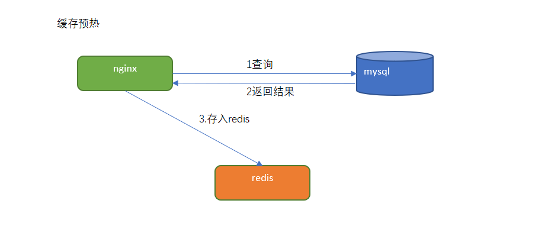
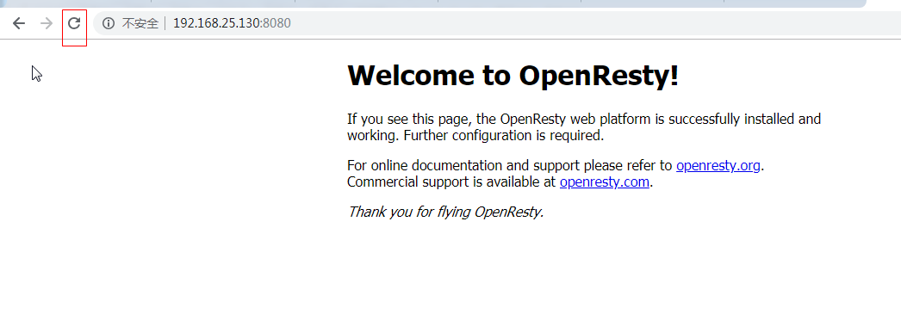

# 第5章 网站首页高可用nginx+lua

## 学习目标

- 了解Lua语言的基本语法
- 使用nginx+Lua+redis实现广告缓存
- 掌握nginx限流的基本使用方法

## 1 Lua介绍

### 1.1 lua是什么

​	Lua 是一个小巧的[脚本语言](https://baike.baidu.com/item/%E8%84%9A%E6%9C%AC%E8%AF%AD%E8%A8%80)。它是巴西里约热内卢天主教大学（Pontifical Catholic University of Rio de Janeiro）里的一个由Roberto Ierusalimschy、Waldemar Celes 和 Luiz Henrique de Figueiredo三人所组成的研究小组于1993年开发的。 其设计目的是为了通过灵活嵌入应用程序中从而为应用程序提供灵活的扩展和定制功能。Lua由标准C编写而成，几乎在所有操作系统和平台上都可以编译，运行。Lua并没有提供强大的库，这是由它的定位决定的。所以Lua不适合作为开发独立应用程序的语言。Lua 有一个同时进行的JIT项目，提供在特定平台上的即时编译功能。

简单来说：

​	Lua 是一种轻量小巧的脚本语言，用标准C语言编写并以源代码形式开放， 其设计目的是为了嵌入应用程序中，从而为应用程序提供灵活的扩展和定制功能。

**lua 语言具有以下特性**

- 支持面向过程(procedure-oriented)编程和函数式编程(functional programming)；
- 自动内存管理；只提供了一种通用类型的表（table），用它可以实现数组，哈希表，集合，对象；
- 语言内置模式匹配；闭包(closure)；函数也可以看做一个值；提供多线程（协同进程，并非操作系统所支持的线程）支持；
- 通过闭包和table可以很方便地支持面向对象编程所需要的一些关键机制，比如数据抽象，虚函数，继承和重载等。

**应用场景**

- 游戏开发
- 独立应用脚本
- Web 应用脚本
- 扩展和数据库插件如：MySQL Proxy 和 MySQL WorkBench
- 安全系统，如入侵检测系统
- redis中嵌套调用实现类似事务的功能
- web容器中应用处理一些过滤 缓存等等的逻辑，例如nginx。 

### 1.2 lua的安装 

有linux版本的安装也有mac版本的安装。。我们采用linux版本的安装，首先我们准备一个linux虚拟机。

安装步骤,在linux系统中执行下面的命令。

```shell
yum install -y gcc
yum install libtermcap-devel ncurses-devel libevent-devel readline-devel
curl -R -O http://www.lua.org/ftp/lua-5.3.5.tar.gz
tar -zxf lua-5.3.5.tar.gz
cd lua-5.3.5
make linux test
make install
```

### 1.3 快速入门 

创建hello.lua文件，内容为

```lua
print("hello");
```

保存。执行命令

```lua
lua helloworld.lua
```

输出为：

```lua
Hello
```

### 1.4 LUA的基本语法 

- lua有交互式编程和脚本式编程。


- 交互式编程就是直接输入语法，就能执行。


- 脚本式编程需要编写脚本，然后再执行命令 执行脚本才可以。


一般采用脚本式编程。（例如：编写一个hello.lua的文件，输入文件内容，并执行lua hell.lua即可）

#### 1.4.1 注释 

一行注释：两个减号是单行注释:

```lua
--
```

多行注释：

```lua
--[[
 多行注释
 多行注释
 --]]
```

#### 1.4.2 关键字 

关键字就好比java中的 break if else等等一样的效果。lua的关键字如下：

|          |       |       |        |
| -------- | ----- | ----- | ------ |
| and      | break | do    | else   |
| elseif   | end   | false | for    |
| function | if    | in    | local  |
| nil      | not   | or    | repeat |
| return   | then  | true  | until  |
| while    |       |       |        |

#### 1.4.3 定义变量 

全局变量，默认的情况下，定义一个变量都是全局变量，

如果要用局部变量 需要声明为local.例如：

```lua
-- 全局变量赋值
a=1
-- 局部变量赋值
local b=2 
```

如果变量没有初始化：则 它的值为nil 这和java中的null不同。

#### 1.4.4 Lua中的数据类型 

Lua 是动态类型语言，变量不要类型定义,只需要为变量赋值。 值可以存储在变量中，作为参数传递或结果返回。

Lua 中有 8 个基本类型分别为：nil、boolean、number、string、userdata、function、thread 和 table。

| 数据类型     | 描述                                       |
| -------- | ---------------------------------------- |
| nil      | 这个最简单，只有值nil属于该类，表示一个无效值（在条件表达式中相当于false）。 |
| boolean  | 包含两个值：false和true。                        |
| number   | 表示双精度类型的实浮点数                             |
| string   | 字符串由一对双引号或单引号来表示                         |
| function | 由 C 或 Lua 编写的函数                          |
| userdata | 表示任意存储在变量中的C数据结构                         |
| thread   | 表示执行的独立线路，用于执行协同程序                       |
| table    | Lua 中的表（table）其实是一个"关联数组"（associative arrays），数组的索引可以是数字、字符串或表类型。在 Lua 里，table 的创建是通过"构造表达式"来完成，最简单构造表达式是{}，用来创建一个空表。 |

#### 1.4.5 流程控制 

如下：类似于if else 

```lua
--[ 0 为 true ]
if(0) then
    print("0 为 true")
else
    print("0 不为true")
end
```

#### 1.4.6 函数 

lua中也可以定义函数，类似于java中的方法。例如：

```lua
--[[ 函数返回两个值的最大值 --]]
function max(num1, num2)

   if (num1 > num2) then
      result = num1;
   else
      result = num2;
   end

   return result; 
end
-- 调用函数
print("两值比较最大值为 ",max(10,4))
print("两值比较最大值为 ",max(5,6))
```

执行之后的结果：

```lua
两值比较最大值为     10
两值比较最大值为     6
```

#### 1.4.7 require 函数 

require 用于 引入其他的模块，类似于java中的类要引用别的类的效果。

用法：

```lua
require("<模块名>")
```

```lua
require "<模块名>"
```

两种都可以。


## 2.nginx+lua+redis实现广告缓存  

### 2.1 需求分析 

需要在页面上显示广告的信息。

 

### 2.2 OpenResty 

#### 2.2.1 OpenResty介绍  

OpenResty(又称：ngx_openresty) 是一个基于 NGINX 的可伸缩的 Web 平台，由中国人章亦春发起，提供了很多高质量的第三方模块。

OpenResty 是一个强大的 Web 应用服务器，Web 开发人员可以使用 Lua 脚本语言调动 Nginx 支持的各种 C 以及 Lua 模块,更主要的是在性能方面，OpenResty可以 快速构造出足以胜任 10K 以上并发连接响应的超高性能 Web 应用系统。

360，UPYUN，阿里云，新浪，腾讯网，去哪儿网，酷狗音乐等都是 OpenResty 的深度用户。

OpenResty 简单理解成 就相当于封装了nginx,并且集成了LUA脚本，开发人员只需要简单的其提供了模块就可以实现相关的逻辑，而不再像之前，还需要在nginx中自己编写lua的脚本，再进行调用了。

#### 2.2.2 OpenResty安装 

linux安装openresty:

1.添加仓库执行命令

```shell
 yum install yum-utils
 yum-config-manager --add-repo https://openresty.org/package/centos/openresty.repo
```

2.执行安装

```shell
yum install openresty
```

3.安装成功后 会在默认的目录如下：

```shell
/usr/local/openresty
```

#### 2.2.3 安装nginx 

默认已经安装好了nginx,在目录：/usr/local/openresty/nginx 下。

修改/usr/local/openresty/nginx/conf/nginx.conf  ,将配置文件使用的根设置为root,目的就是将来要使用lua脚本的时候 ，直接可以加载在root下的lua脚本。

```shell
#user nobody; 配置文件第一行原来为这样, 现改为下面的配置
user root root;
```

测试访问  http://192.168.200.128


### 2.3 实现思路 

#### 2.3.1 表结构分析

tb_ad  （广告表）

| 字段名称       | 字段含义 | 字段类型     | 字段长度 | 备注         |
| ---------- | ---- | -------- | ---- | ---------- |
| id         | ID   | INT      |      |            |
| name       | 广告名称 | VARCHAR  |      |            |
| position   | 广告位置 | VARCHAR  |      | 系统定义       |
| start_time | 开始时间 | DATETIME |      |            |
| end_time   | 到期时间 | DATETIME |      |            |
| status     | 状态   | CHAR     |      | 0：无效  1:有效 |
| image      | 图片地址 | VARCHAR  |      |            |
| url        | URL  | VARCHAR  |      |            |
| remarks    | 备注   | VARCHAR  |      |            |

position：系统定义的广告位置

web_index_lb  首页轮播图

web_index_amusing           有趣区

web_index_ea_lb                 家用电器楼层轮播图

web_index_ea                      家用电器楼层广告

web_index_mobile_lb         手机通讯楼层轮播图

web_index_mobile              手机通讯楼层广告

#### 2.3.2 缓存预热与二级缓存查询

步骤一：编写lua脚本实现缓存预热（将mysql里的数据查询出来存入redis）



步骤二：编写lua脚本实现二级缓存读取


### 2.4 代码实现 

#### 2.4.1 缓存预热

实现思路：

定义请求：用于查询数据库中的数据更新到redis中。

（1）连接mysql ，按照广告分类ID读取广告列表，转换为json字符串。

（2）连接redis，将广告列表json字符串存入redis 。

定义请求：

```
请求：
	/ad_update
参数：
	position  --指定广告位置
返回值：
	json
```

在/root/lua目录下创建ad_load.lua ，实现连接mysql  查询数据 并存储到redis中。

```lua
ngx.header.content_type="application/json;charset=utf8"
local cjson = require("cjson")
local mysql = require("resty.mysql")
local uri_args = ngx.req.get_uri_args()
local position = uri_args["position"]

local db = mysql:new()
db:set_timeout(1000)  
local props = {  
    host = "192.168.200.128",  
    port = 3306,  
    database = "changgou_business",  
    user = "root",  
    password = "123456"  
}

local res = db:connect(props)  
local select_sql = "select url,image from tb_ad where status ='1' and position='"..position.."' and start_time<= NOW() AND end_time>= NOW()"  
res = db:query(select_sql)  
db:close()  

local redis = require("resty.redis")
local red = redis:new()
red:set_timeout(2000)

local ip ="192.168.200.128"
local port = 6379
red:connect(ip,port)

red:set("ad_"..position,cjson.encode(res))
red:close()

ngx.say("{flag:true}")
```


修改/usr/local/openresty/nginx/conf/nginx.conf文件：

代码如下：

```nginx
#user  nobody;
user root root;
worker_processes  1;

#error_log  logs/error.log;
#error_log  logs/error.log  notice;
#error_log  logs/error.log  info;

#pid        logs/nginx.pid;

events {
    worker_connections  1024;
}

http {
    include       mime.types;
    default_type  application/octet-stream;
    sendfile        on;
    #tcp_nopush     on;

    #keepalive_timeout  0;
    keepalive_timeout  65;

    #gzip  on;

    server {
        listen       80;
        server_name  localhost;
        charset utf-8;
        #access_log  logs/host.access.log  main;
        # 添加
        location /ad_update {
            content_by_lua_file /root/lua/ad_update.lua;
        }
        
        # redirect server error pages to the static page /50x.html
        #
        error_page   500 502 503 504  /50x.html;
        location = /50x.html {
            root   html;
        }        
    }
}
```

重新启动nginx

测试：http://192.168.200.128/ad_update?position=web_index_lb

#### 2.4.2 广告缓存读取

实现思路：

定义请求，用户根据广告分类的ID 获取广告的列表。通过lua脚本直接从redis中获取数据即可。

定义请求：

```
请求:/ad_read
参数：position
返回值：json
```

在/root/lua目录下创建ad_read.lua

```lua
--设置响应头类型
ngx.header.content_type="application/json;charset=utf8"
--获取请求中的参数ID
local uri_args = ngx.req.get_uri_args();
local position = uri_args["position"];
--引入redis库
local redis = require("resty.redis");
--创建redis对象
local red = redis:new()
--设置超时时间
red:set_timeout(2000)
--连接
local ok, err = red:connect("192.168.200.128", 6379)
--获取key的值
local rescontent=red:get("ad_"..position)
--输出到返回响应中
ngx.say(rescontent)
--关闭连接
red:close()
```

在/usr/local/openresty/nginx/conf/nginx.conf中server下添加配置

```nginx
        location /ad_read {
            content_by_lua_file /root/lua/ad_read.lua;
        }
```

测试  http://192.168.200.128/ad_read?position=web_index_lb 输出

```json
[{"url":"img\/banner1.jpg","image":"img\/banner1.jpg"},{"url":"img\/banner2.jpg","image":"img\/banner2.jpg"}]
```

#### 2.4.3 加入openresty本地缓存

如上的方式没有问题，但是如果请求都到redis，redis压力也很大，所以我们一般采用多级缓存的方式来减少下游系统的服务压力。

先查询openresty本地缓存 如果没有再查询redis中的数据

- 修改/root/lua目录下ad_read文件, 内容如下:


```lua
--设置响应头类型
ngx.header.content_type="application/json;charset=utf8"
--获取请求中的参数ID
local uri_args = ngx.req.get_uri_args();
local position = uri_args["position"];

--获取本地缓存
local cache_ngx = ngx.shared.dis_cache;
--根据ID 获取本地缓存数据
local adCache = cache_ngx:get('ad_cache_'..position);

if adCache == "" or adCache == nil then

	--引入redis库
	local redis = require("resty.redis");
	--创建redis对象
	local red = redis:new()
	--设置超时时间
	red:set_timeout(2000)
	--连接
	local ok, err = red:connect("192.168.200.128", 6379)
	--获取key的值
	local rescontent=red:get("ad_"..position)
	--输出到返回响应中
	ngx.say(rescontent)
	--关闭连接
	red:close()
	--将redis中获取到的数据存入nginx本地缓存
	cache_ngx:set('ad_cache_'..position, rescontent, 10*60);
else
 	--nginx本地缓存中获取到数据直接输出
 	ngx.say(adCache)
end
```

- 修改nginx配置文件vi /usr/local/openresty/nginx/conf/nginx.conf ，http节点下添加配置:

```nginx
#包含redis初始化模块
lua_shared_dict dis_cache 5m;  #共享内存开启
```

#### 2.4.4 前端页面实现（了解）

（1）修改index.html，编写脚本

```html
	<script type="text/javascript" src="./js/plugins/vue.js"></script>
	<script type="text/javascript" src="./js/plugins/axios.js"></script>
	<script>
	   new Vue({
        el: '#app',
        data: {
            ad: {
				web_index_lb:[]
			}
        },
        methods: {
            adRead: function(position) {
				axios.get('ad_read?position='+position).then(response =>{
					this.ad[position]=response.data					
				})
            }
        },
		created(){
			this.adRead('web_index_lb')
		}
      })
	
	</script>

```

在页面上添加`<div id='app'> ... </div>`

（2）修改index.html，渲染广告轮播图

```html
<div id="myCarousel" data-ride="carousel" data-interval="4000" class="sui-carousel slide">
	<ol class="carousel-indicators">
		<li data-target="#myCarousel" data-slide-to="0" class="active" v-for="item in ad.web_index_lb"></li>
	</ol>
	<div class="carousel-inner" id="lbt">
		<div class="item" v-for="item in contentList">
			<a :href="item.url">
			
		  </a>
		</div>		
	</div>
	<a href="#myCarousel" data-slide="prev" class="carousel-control left">‹</a>
	<a href="#myCarousel" data-slide="next" class="carousel-control right">›</a>
</div>
```

（3）上传至服务器并测试


## 3 nginx限流 

一般情况下，首页的并发量是比较大的，即使有了多级缓存，如果有大量恶意的请求，也会对系统造成影响。而限流就是保护措施之一。

nginx提供两种限流的方式：

- 一是控制速率
- 二是控制并发连接数

### 3.1 控制速率

控制速率的方式之一就是采用漏桶算法。

#### 3.1.1 漏桶算法实现控制速率限流

漏桶(Leaky Bucket)算法思路很简单,水(请求)先进入到漏桶里,漏桶以一定的速度出水(接口有响应速率),当水流入速度过大会直接溢出(访问频率超过接口响应速率),然后就拒绝请求,可以看出漏桶算法能强行限制数据的传输速率.示意图如下:


漏桶算法实现  nginx的配置  

配置示意图如下：


修改/usr/local/openresty/nginx/conf/nginx.conf:

```nginx
#user  nobody;
user root root;
worker_processes  1;

#error_log  logs/error.log;
#error_log  logs/error.log  notice;
#error_log  logs/error.log  info;

#pid        logs/nginx.pid;


events {
    worker_connections  1024;
}


http {
    include       mime.types;
    default_type  application/octet-stream;

    #log_format  main  '$remote_addr - $remote_user [$time_local] "$request" '
    #                  '$status $body_bytes_sent "$http_referer" '
    #                  '"$http_user_agent" "$http_x_forwarded_for"';

    #access_log  logs/access.log  main;

    sendfile        on;
    #tcp_nopush     on;

    #keepalive_timeout  0;
    keepalive_timeout  65;

    #gzip  on;

    # 设置限流配置
    limit_req_zone $binary_remote_addr zone=myRateLimit:10m rate=2r/s;

    server {  
        listen       8081;
        server_name  localhost;
        charset utf-8;
        location / {
            limit_req zone=myRateLimit;
            root   html;
            index  index.html index.htm;
        }
    }
}
```

解释：

```
binary_remote_addr 是一种key，表示基于 remote_addr(客户端IP) 来做限流，binary_ 的目的是压缩内存占用量。
zone：定义共享内存区来存储访问信息， myRateLimit:10m 表示一个大小为10M，名字为myRateLimit的内存区域。1M能存储16000 IP地址的访问信息，10M可以存储16W IP地址访问信息。
rate 用于设置最大访问速率，rate=10r/s 表示每秒最多处理10个请求。Nginx 实际上以毫秒为粒度来跟踪请求信息，因此 10r/s 实际上是限制：每100毫秒处理一个请求。这意味着，自上一个请求处理完后，若后续100毫秒内又有请求到达，将拒绝处理该请求.我们这里设置成2 方便测试。
```

测试：重新加载配置文件

```
cd /usr/local/openresty/nginx/sbin

./nginx -s reload
```

访问页面： 直接报错。拒绝访问。

 

#### 3.1.2 处理突发流量

上面例子限制 10r/s，如果有时正常流量突然增大，超出的请求将被拒绝，无法处理突发流量，可以结合 **burst** 参数使用来解决该问题。

例如，如下配置表示：

```nginx
server {
    location / {
		limit_req zone=myRateLimit burst=20;
        root   html;
        index  index.html index.htm;
    }
}
```

burst 译为突发、爆发，表示在超过设定的处理速率后能额外处理的请求数,当 rate=10r/s 时，将1s拆成10份，即每100ms可处理1个请求。

此处，**burst=20 **，若同时有21个请求到达，Nginx 会处理第一个请求，剩余20个请求将放入队列，然后每隔100ms从队列中获取一个请求进行处理。若请求数大于21，将拒绝处理多余的请求，直接返回503.

不过，单独使用 burst 参数并不实用。假设 burst=50 ，rate依然为10r/s，排队中的50个请求虽然每100ms会处理一个，但第50个请求却需要等待 50 * 100ms即 5s，这么长的处理时间自然难以接受。

因此，burst 往往结合 nodelay 一起使用。

例如：如下配置：

```nginx
server {
    location / {
		limit_req zone=myRateLimit burst=5 nodelay;
        root   html;
        index  index.html index.htm;
    }
}
```

如上表示：

平均每秒允许不超过2个请求，突发不超过5个请求，并且处理突发5个请求的时候，没有延迟，等到完成之后，按照正常的速率处理。

如上两种配置结合就达到了速率稳定，但突然流量也能正常处理的效果。配置代码如下：

```nginx
#user  nobody;
user root root;
worker_processes  1;

#error_log  logs/error.log;
#error_log  logs/error.log  notice;
#error_log  logs/error.log  info;

#pid        logs/nginx.pid;


events {
    worker_connections  1024;
}


http {
    include       mime.types;
    default_type  application/octet-stream;

    #log_format  main  '$remote_addr - $remote_user [$time_local] "$request" '
    #                  '$status $body_bytes_sent "$http_referer" '
    #                  '"$http_user_agent" "$http_x_forwarded_for"';

    #access_log  logs/access.log  main;

    sendfile        on;
    #tcp_nopush     on;

    #keepalive_timeout  0;
    keepalive_timeout  65;

    #gzip  on;

    # 设置限流配置
    limit_req_zone $binary_remote_addr zone=myRateLimit:10m rate=2r/s;

    server {  
        listen       8081;
        server_name  localhost;
        charset utf-8;
        location / {
            limit_req zone=myRateLimit burst = 5 nodelay;
            root   html;
            index  index.html index.htm;
        }
    }
}
```

测试：如下图 在1秒钟之内可以刷新5次，正常处理。




但是超过之后，连续刷新5次，抛出异常。


