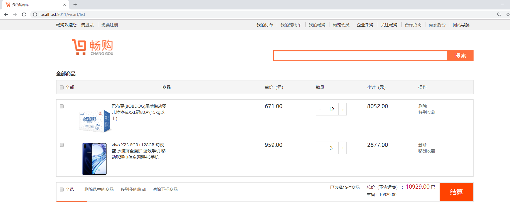

# 第10章 购物车

## 学习目标

- 掌握购物车流程

- 掌握购物车渲染流程

- OAuth2.0认证并获取用户令牌数据

- 微服务与微服务之间的认证


## 1 SpringSecurity权限控制


​	用户每次访问微服务的时候，先去oauth2.0服务登录，登录后再访问微服务网关，微服务网关将请求转发给其他微服务处理。

​	由于我们项目使用了微服务，任何用户都有可能使用任意微服务，此时我们需要控制相关权限，例如：普通用户角色不能使用用户的删除操作，只有管理员才可以使用,那么这个时候就需要使用到SpringSecurity的权限控制功能了。

### 1.1 角色权限加载

在changgou-user-oauth服务中，com.changgou.oauth.config.UserDetailsServiceImpl该类实现了加载用户相关信息，如下代码：


上述代码给登录用户定义了三个角色，分别为`salesman`,`accountant`,`user`，这一块我们目前使用的是硬编码方式将角色写死了。

changgou_user_oauth项目, UserDetailServiceImpl类做如下更改:

```java
//创建权限字符串
//String permissions = "goods_list,seckill_list";
String permissions = "salesman,accountant,user";
```


### 1.2 角色权限控制

在每个微服务中，需要获取用户的角色，然后根据角色识别是否允许操作指定的方法，Spring Security中定义了四个支持权限控制的表达式注解，分别是`@PreAuthorize`、`@PostAuthorize`、`@PreFilter`和`@PostFilter`。其中前两者可以用来在方法调用前或者调用后进行权限检查，后两者可以用来对集合类型的参数或者返回值进行过滤。在需要控制权限的方法上，我们可以添加`@PreAuthorize`注解，用于方法执行前进行权限检查，校验用户当前角色是否能访问该方法。

(1)开启@PreAuthorize

在`changgou-user-service`的`ResourceServerConfig`类上添加`@EnableGlobalMethodSecurity`注解，用于开启@PreAuthorize的支持，代码如下：


(2)方法权限控制

在`changgoug-service-user`微服务的`com.changgou.user.controller.UserController`类的delete()方法上添加权限控制注解`@PreAuthorize`，代码如下：


(3)测试

我们使用Postman测试，先创建令牌，然后将令牌数存放到头文件中访问微服务网关来调用user微服务的delete方法，效果如下：

地址：`http://web.changgou.com:8001/api/user/heima`  提交方式：`DELETE`


发现上面无法访问，因为用户登录的时候，角色不包含admin角色，而search方法需要admin角色，所以被拦截了。


我们再测试其他方法，其他方法没有配置拦截，所以用户登录后就会放行。

访问`http://web.changgou.com:8001/api/user`

效果如下：


### 1.3 小结

如果希望一个方法能被多个角色访问，配置:`@PreAuthorize("hasAnyAuthority('admin','user')")`

如果希望一个类都能被多个角色访问，在类上配置:`@PreAuthorize("hasAnyAuthority('admin','user')")`


## 2 购物车

购物车分为用户登录购物车和未登录购物车操作，国内知名电商京东用户登录和不登录都可以操作购物车，如果用户不登录，操作购物车可以将数据存储到Cookie，用户登录后购物车数据可以存储到Redis中，再将之前未登录加入的购物车合并到Redis中即可。

淘宝天猫则采用了另外一种实现方案，用户要想将商品加入购物车，必须先登录才能操作购物车。

我们今天实现的购物车是天猫解决方案，即用户必须先登录才能使用购物车功能。


### 2.1 购物车业务分析

(1)需求分析

用户在商品详细页点击加入购物车，提交商品SKU编号和购买数量，添加到购物车。购物车展示页面如下：


(2)购物车实现思路


我们实现的是用户登录后的购物车，用户将商品加入购物车的时候，直接将要加入购物车的详情存入到Redis即可。每次查看购物车的时候直接从Redis中获取。


(3)表结构分析

用户登录后将商品加入购物车，需要存储商品详情以及购买数量，购物车详情表如下：

changgou_order数据中tb_order_item表：

```sql
CREATE TABLE `tb_order_item` (
  `id` varchar(20) COLLATE utf8_bin NOT NULL COMMENT 'ID',
  `category_id1` int(11) DEFAULT NULL COMMENT '1级分类',
  `category_id2` int(11) DEFAULT NULL COMMENT '2级分类',
  `category_id3` int(11) DEFAULT NULL COMMENT '3级分类',
  `spu_id` varchar(20) COLLATE utf8_bin DEFAULT NULL COMMENT 'SPU_ID',
  `sku_id` bigint(20) NOT NULL COMMENT 'SKU_ID',
  `order_id` bigint(20) NOT NULL COMMENT '订单ID',
  `name` varchar(200) COLLATE utf8_bin DEFAULT NULL COMMENT '商品名称',
  `price` int(20) DEFAULT NULL COMMENT '单价',
  `num` int(10) DEFAULT NULL COMMENT '数量',
  `money` int(20) DEFAULT NULL COMMENT '总金额',
  `pay_money` int(11) DEFAULT NULL COMMENT '实付金额',
  `image` varchar(200) COLLATE utf8_bin DEFAULT NULL COMMENT '图片地址',
  `weight` int(11) DEFAULT NULL COMMENT '重量',
  `post_fee` int(11) DEFAULT NULL COMMENT '运费',
  `is_return` char(1) COLLATE utf8_bin DEFAULT NULL COMMENT '是否退货',
  PRIMARY KEY (`id`),
  KEY `item_id` (`sku_id`),
  KEY `order_id` (`order_id`)
) ENGINE=InnoDB DEFAULT CHARSET=utf8 COLLATE=utf8_bin;
```


### 2.2 添加购物车

#### 2.2.1 更改订单项实体类

changgou_service_order_api项目OrderItem.java实体类增加属性:

```java
@Table(name="tb_order_item")
public class OrderItem implements Serializable {

	@Id
	private String id;//ID
	private Integer categoryId1;//1级分类
	private Integer categoryId2;//2级分类
	private Integer categoryId3;//3级分类
	private String spuId;//SPU_ID
	private String skuId;//SKU_ID
	private String orderId;//订单ID
	private String name;//商品名称
	private Integer price;//单价
	private Integer num;//数量
	private Integer money;//总金额
	private Integer payMoney;//实付金额
	private String image;//图片地址
	private Integer weight;//重量
	private Integer postFee;//运费
	private String isReturn;//是否退货

	//购物车页面复选框选中或取消
	private boolean checked;

	public boolean isChecked() {
		return checked;
	}

	public void setChecked(boolean checked) {
		this.checked = checked;
	}
```


#### 2.2.2 获取sku数据

changgou_service_goods服务中定义根据id查询sku对象实现

```java
@RestController
@CrossOrigin
@RequestMapping("/sku")
public class SkuController {


    @Autowired
    private SkuService skuService;

    @GetMapping("/{id}")
    public Result<Sku> findById(@PathVariable("id") String id){
        Sku sku = skuService.findById(id);
        return new Result(true,StatusCode.OK,"查询成功",sku);
    }
}
```

#### 2.2.3 定义feign接口

goods-api工程中定义skuFeign接口,并定义查询方法

```java
 /**
     * 根据id查询sku信息
     * @param id
     * @return
     */
    @GetMapping("/{id}")
    public Result<Sku> findById(@PathVariable("id") String id);
```


#### 2.2.4 订单服务添加依赖

```xml
<dependency>
    <groupId>com.changgou</groupId>
    <artifactId>changgou_service_goods_api</artifactId>
    <version>1.0-SNAPSHOT</version>
</dependency>
```

#### 2.2.5 订单微服添加配置

```yml
spring:
  application:
    name: order
  redis:
    host: 192.168.200.128
```


#### 2.2.6 订单服务添加feign接口扫描

OrderApplication.java添加feign接口扫描如下:

```java
@EnableFeignClients(basePackages = "com.changgou.goods.feign")
```


#### 2.2.7  订单服务新建CartController

```java
@RestController
@CrossOrigin
@RequestMapping("/cart")
public class CartController {

    @Autowired
    private CartService cartService;

    /**
     * 添加购物车
     * @param skuId 
     * @param num
     * @return
     */
    @GetMapping("/add")
    public Result add(@RequestParam("skuId") String skuId, @RequestParam("num") Integer num){

        //暂时静态,后续动态获取
        String username = "itcast";
        cartService.add(skuId,num,username);

        return new Result(true, StatusCode.OK,"加入购物车成功");

    }
}
```


#### 2.2.8 订单服务添加cartService

实现添加购物车接口如下:

```java
public interface CartService {

    /**
     * 添加商品到购物车
     * @param skuId     库存id
     * @param num       购买数量
     * @param username  用户名
     */
    public void add(String skuId, Integer num,String username);

}
```

代码如下：

```java
@Service
public class CartServiceImpl implements CartService {

    private static final String CART="Cart_";

    @Autowired
    private RedisTemplate redisTemplate;

    @Autowired
    private SkuFeign skuFeign;

    @Autowired
    private SpuFeign spuFeign;

    /**
     * 添加购物车(购物车中添加商品数量正数负数都可使用)
     * @param skuId
     * @param num
     */
    @Override
    public void add(String skuId, Integer num,String username) {

        /**
         * 1）查询redis中的数据
         * 2）如果redis中已经有了，则追加数量，重新计算金额
         * 3）如果没有，将商品添加到缓存
         */
        OrderItem orderItem = (OrderItem) redisTemplate.boundHashOps(CART+username).get(skuId);
        if (orderItem != null){
            //存在，刷新购物车
            orderItem.setNum(orderItem.getNum()+num);
            //如果本商品在购物车中数量为0则从购物车中删除
            if (orderItem.getNum() <= 0) {
                redisTemplate.boundHashOps(CART+username).delete(skuId);
                return;
            }
            orderItem.setMoney(orderItem.getNum()*orderItem.getPrice());
            orderItem.setPayMoney(orderItem.getNum()*orderItem.getPrice());
        }else{
            //不存在，新增购物车
            Result<Sku> skuResult = skuFeign.findById(skuId);
            Sku sku = skuResult.getData();
            Spu spu = spuFeign.findByspuId(sku.getSpuId());

            //将SKU转换成OrderItem
            orderItem = this.sku2OrderItem(sku,spu,num);
        }

        //存入redis
        redisTemplate.boundHashOps(CART+username).put(skuId,orderItem);
    }

     /**
     * sku转换为orderItem
     * @param sku   库存对象
     * @param spu   商品对象
     * @param num   购买数量
     * @return  订单详情对象
     */
    private OrderItem sku2OrderItem(Sku sku, Spu spu, Integer num) {
        OrderItem orderItem = new OrderItem();
        orderItem.setSpuId(sku.getSpuId());
        orderItem.setSkuId(sku.getId());
        orderItem.setName(sku.getName());
        orderItem.setPrice(sku.getPrice());
        orderItem.setNum(num);
        orderItem.setMoney(num*orderItem.getPrice());       //单价*数量
        orderItem.setPayMoney(num*orderItem.getPrice());    //实付金额
        orderItem.setImage(sku.getImage());
        orderItem.setWeight(sku.getWeight()*num);           //重量=单个重量*数量
        orderItem.setChecked(false);                        //页面购物车商品是否选中

        //分类ID设置
        orderItem.setCategoryId1(spu.getCategory1Id());
        orderItem.setCategoryId2(spu.getCategory2Id());
        orderItem.setCategoryId3(spu.getCategory3Id());
        return orderItem;
    }
}
```


测试添加购物车，效果如下：

请求地址` http://cart.changgou.com:9002/cart/add?skuId=100000022652&num=1 `


Redis缓存中已经有商品了


### 2.3 购物车列表

#### 2.3.1 思路分析


接着我们实现一次购物车列表操作。因为存的时候是根据用户名往Redis中存储用户的购物车数据的，所以我们这里可以将用户的名字作为key去Redis中查询对应的数据。


#### 2.3.2 代码实现

(1)控制层

com.changgou.order.controller.CartController类，添加购物车列表查询方法，代码如下：

```java
/***
 * 查询用户购物车列表
 * @return
*/
@GetMapping(value = "/list")
public Map list(){
    //暂时静态，后续修改
    String username = "itcast";
    return cartService.list(username);
}
```


(2)业务层

业务层接口

com.changgou.order.service.CartService接口，添加购物车列表方法，代码如下：

```java
/***
  * 查询用户的购物车数据
  * @return
  */
 Map list(String username);
```


业务层接口实现类

com.changgou.order.service.impl.CartServiceImpl类，添加购物车列表实现方法，代码如下：

```java
	/**
     * 获取购物车列表数据
     * @param username
     * @return
     */
    @Override
    public Map list(String username) {
        Map map = new HashMap();
        List<OrderItem> orderItemList = redisTemplate.boundHashOps(CART+username).values();

        map.put("orderItemList",orderItemList);

        //商品数量与总价格
        Integer totalNum = 0;
        Integer totalPrice = 0;

        for (OrderItem orderItem : orderItemList) {
            totalNum +=orderItem.getNum();
            totalPrice+=orderItem.getMoney();
        }
        map.put("totalNum",totalNum);
        map.put("totalPrice",totalPrice);
        return map;
    }
```


(3)测试

使用Postman访问 GET http://cart.changgou.com:9002/cart/list ,效果如下：


### 2.4 删除购物车中商品

更改changgou_service_order项目

1.  controller层代码:

```java
/**
 * 删除加入购物车中的商品
 * @param skuId
 * @return
 */
@GetMapping("/delete")
public Result delete(@RequestParam(name = "skuId") String skuId) {
    //暂时静态，后续修改
    String username = "itcast";
    cartService.delete(skuId, username);
    return new Result(true, StatusCode.OK,"删除成功");
}
```


2. service层接口代码:

```java
/**
 * 删除加入购物车中的商品
 * @param skuId
 * @param username
 */
public void delete(String skuId, String username);
```


3. service层实现类代码:

```java
@Override
public void delete(String skuId, String username) {
    if (StringUtils.isEmpty(username)) {
        throw new RuntimeException("您必须登录才可以进行删除操作!");
    }

    redisTemplate.boundHashOps(CART+username).delete(skuId);
}
```


### 2.5 勾选/取消勾选购物车中商品

1. controller层代码实现:

```java
/**
 * 更新购物车选项 复选框
 */
@GetMapping("/updateChecked")
public void updateChecked(@RequestParam(name = "skuId") String skuId,@RequestParam(name = "checked") Boolean checked){
    //暂时静态，后续修改
    String username = "itcast";
    cartService.updateChecked(skuId, checked, username);
}
```

2. service层接口代码实现:

```java
/**
 * 购物车商品是否选中
 * @param skuId     库存id
 * @param checked   是否选中
 */
public void updateChecked(String skuId,Boolean checked, String username);
```


3. service层实现类代码实现:

```java
@Override
public void updateChecked(String skuId, Boolean checked, String username) {
    Set keys = redisTemplate.boundHashOps(CART + username).keys();
    for (Object key : keys) {
        if(key.equals(skuId)){
            OrderItem orderItem = (OrderItem) redisTemplate.boundHashOps(CART + username).get(key);
            orderItem.setChecked(checked);
            redisTemplate.boundHashOps(CART + username).put(orderItem.getSkuId(),orderItem);
        }
    }
}
```


## 3 购物车渲染


​	如上图所示,用户每次将商品加入购物车，或者点击购物车列表的时候，先经过订单购物车后端渲染服务，再通过feign调用购物车订单微服务来实现购物车的操作，例如：加入购物车、购物车列表。


### 3.1 购物车渲染服务搭建

在changgou_web中搭建订单购物车微服务工程`changgou_web_order`，该工程主要实现购物车和订单的渲染操作。

(1) pom.xml依赖

```xml
<?xml version="1.0" encoding="UTF-8"?>
<project xmlns="http://maven.apache.org/POM/4.0.0"
         xmlns:xsi="http://www.w3.org/2001/XMLSchema-instance"
         xsi:schemaLocation="http://maven.apache.org/POM/4.0.0 http://maven.apache.org/xsd/maven-4.0.0.xsd">
    <parent>
        <artifactId>changgou-web</artifactId>
        <groupId>com.changgou</groupId>
        <version>1.0-SNAPSHOT</version>
    </parent>
    <modelVersion>4.0.0</modelVersion>
    <artifactId>changgou_web_order</artifactId>

    <!--依赖-->
    <dependencies>
        <dependency>
            <groupId>com.changgou</groupId>
            <artifactId>changgou_service_order_api</artifactId>
            <version>1.0-SNAPSHOT</version>
        </dependency>
        <dependency>
            <groupId>com.changgou</groupId>
            <artifactId>changgou_common</artifactId>
            <version>1.0-SNAPSHOT</version>
        </dependency>
        <dependency>
            <groupId>org.springframework.boot</groupId>
            <artifactId>spring-boot-starter-thymeleaf</artifactId>
        </dependency>
    </dependencies>
</project>
```

(2)application.yml配置

```properties
server:
  port: 9111
spring:
  application:
    name: order-web
  main:
    allow-bean-definition-overriding: true   #当遇到同样名字的时候，是否允许覆盖注册
  thymeleaf:
    cache: false
eureka:
  client:
    service-url:
      defaultZone: http://127.0.0.1:6868/eureka
  instance:
    prefer-ip-address: true
feign:
  hystrix:
    enabled: true
  client:
    config:
      default:   #配置全局的feign的调用超时时间  如果 有指定的服务配置 默认的配置不会生效
        connectTimeout: 60000 # 指定的是 消费者 连接服务提供者的连接超时时间 是否能连接  单位是毫秒
        readTimeout: 80000  # 指定的是调用服务提供者的 服务 的超时时间（）  单位是毫秒
#hystrix 配置
hystrix:
  command:
    default:
      execution:
        timeout:
          #如果enabled设置为false，则请求超时交给ribbon控制
          enabled: true
        isolation:
          strategy: SEMAPHORE
          thread:
            # 熔断器超时时间，默认：1000/毫秒
            timeoutInMilliseconds: 80000
```

(3)创建启动类

创建com.changgou.OrderWebApplication启动类，代码如下：

```java
@SpringBootApplication
@EnableEurekaClient
@EnableFeignClients(basePackages = "com.changgou.order.feign")
public class OrderWebApplication {

    public static void main(String[] args) {
        SpringApplication.run(OrderWebApplication.class,args);
    }
}
```

(4)静态资源拷贝

资源\成品页面\cart.html页面拷贝到工程中，如下图：


### 3.2 购物车列表渲染

#### 3.2.1 Feign创建

在changgou_service_order_api中添加CartFeign接口，并在接口中创建添加购物车和查询购物车列表，代码如下：

```java
@FeignClient(name="order")
public interface CartFeign {

    /**
     * 添加购物车
     * @param skuId
     * @param num
     * @return
     */
    @GetMapping("/cart/add")
    public Result add(@RequestParam("skuId") String skuId, @RequestParam("num") Integer num);

    /***
     * 查询用户购物车列表
     * @return
     */
    @GetMapping(value = "/cart/list")
    public Map list();
    
    /**
     * 删除加入购物车中的商品
     * @param skuId
     * @return
     */
    @GetMapping("/cart/delete")
    public Result delete(@RequestParam("skuId") String skuId);

    /**
     * 更新购物车选项 复选框
     */
    @GetMapping("/cart/updateChecked")
    public void updateChecked(@RequestParam(name = "skuId") String skuId,@RequestParam(name = "checked") Boolean checked);
}
```

#### 3.2.2 后台代码

在changgou_web_order中创建com.changgou.order.controller.CartController,并添加查询购物车集合方法和添加购物车方法，代码如下：

```java
@Controller
@RequestMapping("/wcart")
public class CartController {

    /**
     * 协议://域名:端口/网关中配置的前缀/...
     */
    //未对接网关以及oauth的访问地址
    public static final String URL = "http://cart.changgou.com:9111";
    //对接网关以及oauth的访问地址
    //public static final String URL = "http://web.changgou.com:8001/api";

    @Autowired
    private CartFeign cartFeign;

    /***
     * 查询用户购物车列表
     * @return
     */
    @GetMapping(value = "/list")
    public String list(Model model){
        model.addAttribute("result",cartFeign.list());
        model.addAttribute("user","itcast");
        return "cart";
    }


    //加入购物车
    @GetMapping("/add")
    public String add(String skuId, Integer num){
        cartFeign.add(skuId,num);
        //重定向到  协议://域名:端口/网关中配置的前缀/当前controller地址/查询购物车列表方法地址
        return "redirect:"+URL+"/wcart/list";
    }

    //删除购物车中商品
    @GetMapping("/delete")
    public String delete(String skuId){
        cartFeign.delete(skuId);
        return "redirect:"+URL+"/wcart/list";
    }

    /**
     * 更新购物车选项 复选框
     */
    @GetMapping("/updateChecked")
    public String updateChecked(String skuId,Boolean checked){

        cartFeign.updateChecked(skuId,checked);

        return "redirect:" + URL + "/wcart/list";
    }

}
```

浏览器测试访问:  http://cart.changgou.com:9111/wcart/list

运行之后，效果如下：




### 3.3 删除商品购物车

我们发现个问题，就是用户将商品加入购物车，无论数量是正负，都会执行添加购物车，如果数量如果<=0，应该移除该商品的。

修改changgou-service-order的com.changgou.order.service.impl.CartServiceImpl的add方法，添加如下代码：


## 4. 订单服务权限对接

### 4.1 订单服务对接oauth

1）配置公钥

​		将changgou_user_oauth项目的public.key拷贝到changgou_service_order项目的resource目录下

2）changgou_service_order项目添加oauth依赖

```xml
<dependency>
    <groupId>org.springframework.cloud</groupId>
    <artifactId>spring-cloud-starter-oauth2</artifactId>
</dependency>
```

3) changgou_service_order项目添加添加配置类

```java
@Configuration
@EnableResourceServer
//开启方法上的PreAuthorize注解
@EnableGlobalMethodSecurity(prePostEnabled = true, securedEnabled = true)
public class ResourceServerConfig extends ResourceServerConfigurerAdapter {

    //公钥
    private static final String PUBLIC_KEY = "public.key";

    /***
     * 定义JwtTokenStore
     * @param jwtAccessTokenConverter
     * @return
     */
    @Bean
    public TokenStore tokenStore(JwtAccessTokenConverter jwtAccessTokenConverter) {
        return new JwtTokenStore(jwtAccessTokenConverter);
    }

    /***
     * 定义JJwtAccessTokenConverter
     * @return
     */
    @Bean
    public JwtAccessTokenConverter jwtAccessTokenConverter() {
        JwtAccessTokenConverter converter = new JwtAccessTokenConverter();
        converter.setVerifierKey(getPubKey());
        return converter;
    }
    /**
     * 获取非对称加密公钥 Key
     * @return 公钥 Key
     */
    private String getPubKey() {
        Resource resource = new ClassPathResource(PUBLIC_KEY);
        try {
            InputStreamReader inputStreamReader = new InputStreamReader(resource.getInputStream());
            BufferedReader br = new BufferedReader(inputStreamReader);
            return br.lines().collect(Collectors.joining("\n"));
        } catch (IOException ioe) {
            return null;
        }
    }

    /***
     * Http安全配置，对每个到达系统的http请求链接进行校验
     * @param http
     * @throws Exception
     */
    @Override
    public void configure(HttpSecurity http) throws Exception {
        //所有请求必须认证通过
        http.authorizeRequests()
                .anyRequest().
                authenticated();    //其他地址需要认证授权
    }
}
```

### 4.2 微服务间认证


如上图：因为微服务之间并没有传递头文件，所以我们可以定义一个拦截器，每次微服务调用之前都先检查下头文件，将请求的头文件中的令牌数据再放入到header中，再调用其他微服务即可。

测试访问购物车，产生如下效果：


#### 4.2.1 feign拦截器实现微服务间认证

(1)创建拦截器

在changgou_common服务中创建一个com.changgou.interceptor.FeignInterceptor拦截器，并将所有头文件数据再次加入到Feign请求的微服务头文件中，代码如下：

```java
/**
 * 自定义拦截器, 拦截所有请求
 * 每次微服务调用之前都先检查下头文件，将请求的头文件中的令牌数据再放入到header中
 */
@Component
public class FeignInterceptor implements RequestInterceptor {

    @Override
    public void apply(RequestTemplate requestTemplate) {

        RequestAttributes requestAttributes = RequestContextHolder.getRequestAttributes();

        if (requestAttributes!=null){

            HttpServletRequest request = ((ServletRequestAttributes) requestAttributes).getRequest();
            if (request!=null){
                Enumeration<String> headerNames = request.getHeaderNames();
                if (headerNames!=null){
                    while (headerNames.hasMoreElements()){
                        String headerName = headerNames.nextElement();
                        if (headerName.equals("authorization")){
                            String headerValue = request.getHeader(headerName);
                            requestTemplate.header(headerName,headerValue);
                        }
                    }
                }
            }
        }
        }
}
```

2) 更改changgou_order_web启动类，添加拦截器声明

```java
@Bean
public FeignInterceptor feignInterceptor(){
    return new FeignInterceptor();
}
```

### 4.3 购物车渲染、订单服务对接网关

1)  修改微服务网关`changgou-gateway-web`的application.yml配置文件，添加order的路由过滤配置，配置如下：

```yml
spring:
  application:
    name: gateway-web
  cloud:
    gateway:
      globalcors:
        cors-configurations:
          '[/**]': # 匹配所有请求
            allowedOrigins: "*" #跨域处理 允许所有的域
            allowedMethods: # 支持的方法
              - GET
              - POST
              - PUT
              - DELETE
      routes:
        - id: changgou_goods_route
          uri: lb://goods
          predicates:
            - Path=/api/album/**,/api/brand/**,/api/cache/**,/api/categoryBrand/**,/api/category/**,/api/para/**,/api/pref/**,/api/sku/**,/api/spec/**,/api/spu/**,/api/stockBack/**,/api/template/**
          filters:
            #- PrefixPath=/brand
            - StripPrefix=1
          #用户微服务
        - id: changgou_user_route
          uri: lb://user
          predicates:
            - Path=/api/user/**,/api/address/**,/api/areas/**,/api/cities/**,/api/provinces/**
          filters:
            - StripPrefix=1
          #认证微服务
        - id: changgou_oauth_user
          uri: lb://user-auth
          predicates:
            - Path=/api/oauth/**
          filters:
            - StripPrefix=1
        #订单微服务
        - id: changgou_order_route
          uri: lb://order
          predicates:
            - Path=/api/cart/**,/api/categoryReport/**,/api/orderConfig/**,/api/order/**,/api/orderItem/**,/api/orderLog/**,/api/preferential/**,/api/returnCause/**,/api/returnOrder/**,/api/returnOrderItem/**
          filters:
            - StripPrefix=1
        #购物车订单渲染微服务
        - id: changgou_order_web_route
          uri: lb://order-web
          predicates:
            - Path=/api/wcart/**
          filters:
            - StripPrefix=1
  redis:
    host: 192.168.200.128
server:
  port: 8001
eureka:
  client:
    service-url:
      defaultZone: http://127.0.0.1:6868/eureka
  instance:
    prefer-ip-address: true
management:
  endpoint:
    gateway:
      enabled: true
    web:
      exposure:
        include: true
```

2)  添加自定义路径过滤类到网关项目中:

```java
public class UrlFilter {

    //购物车订单微服务都需要用户登录，必须携带令牌，所以所有路径都过滤,订单微服务需要过滤的地址
    public static String orderFilterPath = "/api/wxpay,/api/wxpay/**,/api/worder/**,/api/user/**,/api/address/**,/api/wcart/**,/api/cart/**,/api/categoryReport/**,/api/orderConfig/**,/api/order/**,/api/orderItem/**,/api/orderLog/**,/api/preferential/**,/api/returnCause/**,/api/returnOrder/**,/api/returnOrderItem/**";

    public static boolean hasAuthorize(String url){

        String[] strings = orderFilterPath.replace("**", "").split(",");
        for (String uri : strings) {

            if (url.startsWith(uri)){
                return true;
            }
        }
        return false;
    }
}
```

3)  更改网关全局过滤器

AuthFilter.java

```java
String path = request.getURI().getPath();
if ("/api/oauth/login".equals(path) || !UrlFilter.hasAuthorize(path)){
    //放行
    return chain.filter(exchange);
}
```


### 4.4  动态获取当前登陆人

#### 4.4.1 数据分析

用户登录后，数据会封装到`SecurityContextHolder.getContext().getAuthentication()`里面，我们可以将数据从这里面取出，然后转换成`OAuth2AuthenticationDetails`,在这里面可以获取到令牌信息、令牌类型等，代码如下：


​	这里的tokenValue是加密之后的令牌数据，remoteAddress是用户的IP信息，tokenType是令牌类型。

​	我们可以获取令牌加密数据后，使用公钥对它进行解密，如果能解密说明数据无误，如果不能解密用户也没法执行到这一步。解密后可以从明文中获取用户信息。

#### 4.4.2 代码实现

因为该类在很多微服务中都会被使用到，所以需要将该类添加到common工程中

（1）在changgou-common工程中引入鉴权包

```xml
<!--鉴权-->
<dependency>
    <groupId>io.jsonwebtoken</groupId>
    <artifactId>jjwt</artifactId>
    <version>0.9.0</version>
    <scope>provided</scope>
</dependency>
```


（2）添加资源中的TokenDecode工具类到changgou-service-order微服务config包下，用于解密令牌信息

代码如下：

```java
import com.alibaba.fastjson.JSON;
import org.springframework.core.io.ClassPathResource;
import org.springframework.core.io.Resource;
import org.springframework.security.core.context.SecurityContextHolder;
import org.springframework.security.jwt.Jwt;
import org.springframework.security.jwt.JwtHelper;
import org.springframework.security.jwt.crypto.sign.RsaVerifier;
import org.springframework.security.oauth2.provider.authentication.OAuth2AuthenticationDetails;
import org.springframework.util.StringUtils;

import java.io.BufferedReader;
import java.io.IOException;
import java.io.InputStreamReader;
import java.util.Map;
import java.util.stream.Collectors;

public class TokenDecode {
    //公钥
    private static final String PUBLIC_KEY = "public.key";

    private static String publickey="";

    /***
     * 获取用户信息
     * @return
     */
    public Map<String,String> getUserInfo(){
        //获取授权信息
        OAuth2AuthenticationDetails details = (OAuth2AuthenticationDetails) SecurityContextHolder.getContext().getAuthentication().getDetails();
        //令牌解码
        return dcodeToken(details.getTokenValue());
    }

    /***
     * 读取令牌数据
     */
    public Map<String,String> dcodeToken(String token){
        //校验Jwt
        Jwt jwt = JwtHelper.decodeAndVerify(token, new RsaVerifier(getPubKey()));

        //获取Jwt原始内容
        String claims = jwt.getClaims();
        return JSON.parseObject(claims,Map.class);
    }


    /**
     * 获取非对称加密公钥 Key
     * @return 公钥 Key
     */
    public String getPubKey() {
        if(!StringUtils.isEmpty(publickey)){
            return publickey;
        }
        Resource resource = new ClassPathResource(PUBLIC_KEY);
        try {
            InputStreamReader inputStreamReader = new InputStreamReader(resource.getInputStream());
            BufferedReader br = new BufferedReader(inputStreamReader);
            publickey = br.lines().collect(Collectors.joining("\n"));
            return publickey;
        } catch (IOException ioe) {
            return null;
        }
    }
}
```

（3）将该工具类以bean的形式声明到order服务中并且加入feign坐标

```xml
<dependency>
    <groupId>org.springframework.cloud</groupId>
    <artifactId>spring-cloud-starter-openfeign</artifactId>
</dependency>
```


```java
@SpringBootApplication
@EnableEurekaClient
@MapperScan(basePackages = {"com.changgou.order.dao"})
@EnableFeignClients(basePackages = "com.changgou.goods.feign")
public class OrderApplication {

    public static void main(String[] args) {
        SpringApplication.run( OrderApplication.class);
    }

    /**
     * 初始化解析令牌对象
     * @return
     */
    @Bean
    public TokenDecode tokenDecode() {
        return new TokenDecode();
    }
}
```

(4)控制层获取用户数据

在CartController中注入TokenDecode，并调用TokenDecode的getUserInfo方法获取用户信息，代码如下：

注入TokenDecode：

```java
@Autowired
private TokenDecode tokenDecode;

//将所有硬编码的用户名换成
String username = tokenDecode.getUserInfo().get("username");
```

获取用户名：


### 4.5 页面配置

#### 4.5.1 静态化资源加载

之前已经完成了登录页面的功能实现，当登录成功之后，我们再打开之前的购物车页面，效果如下图：


​	这个时候，我们发现所有样式都没有了，这是因为我们这里请求地址经过了微服务网关，会基于网关加载静态化资源，但是此时网关工程中并没有相关资源，所以这时候会造成404问题。要解决此问题的话，只需要将相关静态化资源放入网关工程并重新访问即可。

​	

#### 4.5.2 未登录时登录跳转

​	在用户没有登录的情况下，直接访问购物车页面，效果如下：


​	我们可以发现，返回的只是个错误状态码，这个毫无意义，我们应该重定向到登录页面，让用户登录，我们可以修改网关的头文件，让用户每次没登录的时候，都跳转到登录页面。

​	修改changgou-gateway-web的`com.changgou.filter.AuthFilter`，代码如下：

```java
@Component
public class AuthFilter implements GlobalFilter, Ordered {

    public static final String Authorization = "Authorization";

    //登录地址
    public static final String LOGIN_URL = "http://web.changgou.com:8001/api/oauth/toLogin";

    @Autowired
    private AuthService authService;

    @Override
    public Mono<Void> filter(ServerWebExchange exchange, GatewayFilterChain chain) {
        //获取当前请求对象
        ServerHttpRequest request = exchange.getRequest();
        ServerHttpResponse response = exchange.getResponse();

        String path = request.getURI().getPath();
        if ("/api/oauth/login".equals(path) || !UrlFilter.hasAuthorize(path)){
            //放行
            return chain.filter(exchange);
        }

        //判断cookie上是否存在jti也就是短令牌
        String jti = authService.getJtiFromCookie(request);
        if (StringUtils.isEmpty(jti)){
            //拒绝访问,请求跳转
//            response.setStatusCode(HttpStatus.UNAUTHORIZED);
//            return response.setComplete();
            return this.toLoginPage(LOGIN_URL, exchange);
        }

        //根据短令牌获取长令牌, 并且判断是否有长令牌
        String token = authService.getTokenFromRedis(jti);
        if (StringUtils.isEmpty(token)){
            //拒绝访问，请求跳转
//            response.setStatusCode(HttpStatus.UNAUTHORIZED);
//            return response.setComplete();
            return this.toLoginPage(LOGIN_URL, exchange);
        }

        //校验通过 , 请求头增强，放行(将长令牌放入请求头)
        request.mutate().header(Authorization,"Bearer "+token);
        return chain.filter(exchange);
    }

    /**
     * 跳转到登录页面
     * @param loginUrl  跳转的地址
     * @return
     */
    private Mono<Void> toLoginPage(String loginUrl, ServerWebExchange exchange) {
        ServerHttpResponse response = exchange.getResponse();
        response.setStatusCode(HttpStatus.SEE_OTHER);
        response.getHeaders().set("Location", loginUrl);
        return response.setComplete();
    }

    @Override
    public int getOrder() {
        return 0;
    }
}
```

此时再测试，就可以跳转到登录页面了。

访问：http://web.changgou.com:8001/api/wcart/list

#### 4.5.3 登录成功跳转原地址

​	刚才已经实现了未登录时跳转登录页，但是当登录成功后，并没有跳转到用户本来要访问的页面。

​	要实现这个功能的话，可以将用户要访问的页面作为参数传递到登录控制器，由登录控制器根据参数完成路径跳转

1) 修改网关携带当前访问URI

修改changgou-gateway-web的`com.changgou.filter.AuthFilter`，在之前的URL后面添加ReturnUrl参数以及ReturnUrl参数的值为`request.getURI()`，代码如下：


```java
@Override
public Mono<Void> filter(ServerWebExchange exchange, GatewayFilterChain chain) {
    //获取当前请求对象
    ServerHttpRequest request = exchange.getRequest();
    ServerHttpResponse response = exchange.getResponse();

    String path = request.getURI().getPath();
    if ("/api/oauth/login".equals(path) || !UrlFilter.hasAuthorize(path)){
        //放行
        return chain.filter(exchange);
    }

    //判断cookie上是否存在jti也就是短令牌
    String jti = authService.getJtiFromCookie(request);
    if (StringUtils.isEmpty(jti)){
        //拒绝访问,请求跳转
        //            response.setStatusCode(HttpStatus.UNAUTHORIZED);
        //            return response.setComplete();
        return this.toLoginPage(LOGIN_URL + "?ReturnUrl=" + request.getURI(), exchange);
    }

    //根据短令牌获取长令牌, 并且判断是否有长令牌
    String token = authService.getTokenFromRedis(jti);
    if (StringUtils.isEmpty(token)){
        //拒绝访问，请求跳转
        //            response.setStatusCode(HttpStatus.UNAUTHORIZED);
        //            return response.setComplete();
        return this.toLoginPage(LOGIN_URL + "?ReturnUrl=" + request.getURI(), exchange);
    }
    
    //........略
```

2）登录控制器获取参数

修改changgou-user-oauth的`com.changgou.oauth.controller.AuthController`记录访问来源页，代码如下：

```java
@RequestMapping("/toLogin")
public String toLogin(@RequestParam(value = "ReturnUrl", required = false, defaultValue = "") String ReturnUrl, Model model) throws Exception{
     model.addAttribute("ReturnUrl",ReturnUrl);
     return "login";
}
```


#### 4.5.4 页面变更

​	用户可以点击+号或者-号，或者手动输入一个数字，然后更新购物车列表，我们可以给-+号一个点击事件，给数字框一个失去焦点事件，然后调用后台，实现购物车的更新。

changgou_web_order项目的cart.html变更如下: 页面通过网关访问

```html
<li class="yui3-u-1-8">
    <span class="price" th:text="${#numbers.formatDecimal(item.price/100.0,1,2)}"></span></li>

<li class="yui3-u-1-8">
     
    <a th:href="@{//web.changgou.com:8001/api/wcart/add(skuId=${item.skuId},num=-1)}" class="increment mins">-</a>
    
    <input autocomplete="off" type="text" th:value="${item.num}" minnum="1" class="itxt" />
    
    <a th:href="@{//web.changgou.com:8001/api/wcart/add(skuId=${item.skuId},num=1)}" class="increment plus">+</a>

</li>

<li class="yui3-u-1-8">
    <span class="sum" th:text="${#numbers.formatDecimal(item.money/100.0,1,2)}"></span></li>
<li class="yui3-u-1-8">
     <a th:href="@{//web.changgou.com:8001/api/wcart/add(skuId=${item.skuId},num=-${item.num})}">删除</a><br />
    <a href="#none">移到收藏</a>
</li>


<script type="text/javascript">
    $(".chooseAll").click(function(){
        $("input[name='chk_list']").prop("checked", $(this).prop("checked"));
    })

    function  updateChecked(id,checked){
        location.href=`http://web.changgou.com:8001/api/wcart/updateChecked?skuId=${id}&checked=${!checked}`
    }


</script>
```


#### 4.5.5 Controller跳转地址变更

changgou_web_order项目的CartController,  地址跳转通过网关跳转:

```java
@Controller
@RequestMapping("/wcart")
public class CartController {

    /**
     * 协议://域名:端口/网关中配置的前缀/...
     */
    //未对接网关以及oauth的访问地址
    //public static final String URL = "http://web.changgou.com:9111";
    //对接网关以及oauth的访问地址
    public static final String URL = "http://web.changgou.com:8001/api";
```

## 5. 浏览器测试路径

登录并访问购物车列表: 

http://web.changgou.com:8001/api/oauth/toLogin?ReturnUrl=http://web.changgou.com:8001/api/wcart/list

此时再测试，就可以识别未登录用户，跳转到登录页，然后根据登录状态，如果登录成功，则跳转到来源页。

添加商品路径:

http://web.changgou.com:8001/api/wcart/add?skuId=100000015158&num=1

登录并添加商品路径:

http://web.changgou.com:8001/api/oauth/toLogin?ReturnUrl=http://web.changgou.com:8001/api/wcart/add?skuId=100000015158&num=1

