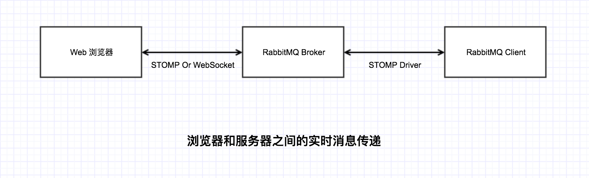
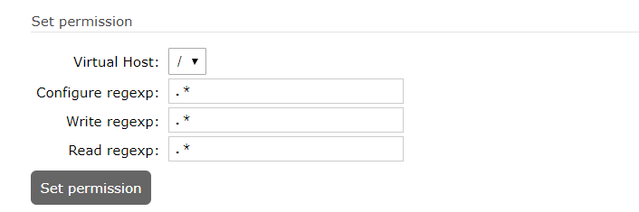

# 第12章 微信扫码支付  

## 学习目标：

- 能够根据微信支付的开发文档调用微信支付的api
- 完成统一下单生成微信支付二维码功能
- 完成支付回调的逻辑处理
- 完成推送支付通知功能


## 1. 微信支付快速入门


### 1.1 微信支付申请（了解）

**第一步：注册公众号（类型须为：服务号）**

请根据营业执照类型选择以下主体注册：[个体工商户](http://kf.qq.com/faq/120911VrYVrA151009JB3i2Q.html)| [企业/公司](http://kf.qq.com/faq/120911VrYVrA151013MfYvYV.html)| [政府](http://kf.qq.com/faq/161220eaAJjE161220IJn6zU.html)| [媒体](http://kf.qq.com/faq/161220IFBJFv161220YnqAbQ.html)| [其他类型](http://kf.qq.com/faq/120911VrYVrA151013nYFZ7Z.html)。

**第二步：认证公众号**

公众号认证后才可申请微信支付，认证费：300元/次。

**第三步：提交资料申请微信支付**

登录公众平台，点击左侧菜单【微信支付】，开始填写资料等待审核，审核时间为1-5个工作日内。

**第四步：开户成功，登录商户平台进行验证**

资料审核通过后，请登录联系人邮箱查收商户号和密码，并登录商户平台填写财付通备付金打的小额资金数额，完成账户验证。

**第五步：在线签署协议**

本协议为线上电子协议，签署后方可进行交易及资金结算，签署完立即生效。

本课程已经提供好“传智播客”的微信支付账号，学员无需申请。

完成上述步骤，你可以得到调用API用到的账号和密钥

appid：微信公众账号或开放平台APP的唯一标识  wx8397f8696b538317

mch_id：商户号  1473426802

key：商户密钥   T6m9iK73b0kn9g5v426MKfHQH7X8rKwb

### 1.2 微信支付开发文档与SDK

在线微信支付开发文档：

https://pay.weixin.qq.com/wiki/doc/api/index.html

微信支付接口调用的整体思路：

按API要求组装参数，以XML方式发送（POST）给微信支付接口（URL）,微信支付接口也是以XML方式给予响应。程序根据返回的结果（其中包括支付URL）生成二维码或判断订单状态。

我们解压从官网下载的sdk ,安装到本地仓库

com.github.wxpay.sdk.WXPay类下提供了对应的方法：

| 方法名              | 说明          |
| ---------------- | ----------- |
| microPay         | 刷卡支付        |
| unifiedOrder     | 统一下单        |
| orderQuery       | 查询订单        |
| reverse          | 撤销订单        |
| closeOrder       | 关闭订单        |
| refund           | 申请退款        |
| refundQuery      | 查询退款        |
| downloadBill     | 下载对账单       |
| report           | 交易保障        |
| shortUrl         | 转换短链接       |
| authCodeToOpenid | 授权码查询openid |


### 1.3 统一下单API

（1）创建changgou_service_pay 引入微信支付Api

```xml
<dependencies>
    <dependency>
        <groupId>com.changgou</groupId>
        <artifactId>changgou_common</artifactId>
        <version>1.0-SNAPSHOT</version>
    </dependency>
    <dependency>
        <groupId>com.github.wxpay</groupId>
        <artifactId>wxpay-sdk</artifactId>
        <version>3.0.9</version>
        <exclusions>
            <exclusion>
                <groupId>org.slf4j</groupId>
                <artifactId>slf4j-simple</artifactId>
            </exclusion>
            <exclusion>
                <groupId>org.slf4j</groupId>
                <artifactId>slf4j-api</artifactId>
            </exclusion>
        </exclusions>
    </dependency>
    <dependency>
        <groupId>org.springframework.boot</groupId>
        <artifactId>spring-boot-starter-amqp</artifactId>
    </dependency>
    <dependency>
        <groupId>com.changgou</groupId>
        <artifactId>changgou_service_order_api</artifactId>
        <version>1.0-SNAPSHOT</version>
    </dependency>
    <dependency>
        <groupId>org.springframework.cloud</groupId>
        <artifactId>spring-cloud-starter-oauth2</artifactId>
    </dependency>
    <dependency>
        <groupId>com.changgou</groupId>
        <artifactId>changgou_service_pay_api</artifactId>
        <version>1.0-SNAPSHOT</version>
    </dependency>
    <dependency>
        <groupId>org.springframework.cloud</groupId>
        <artifactId>spring-cloud-starter-oauth2</artifactId>
    </dependency>
</dependencies>
```

changgou_service_pay项目的application.yml配置文件

```yml
server:
  port: 9010
spring:
  application:
    name: pay
  rabbitmq:
    host: 192.168.200.128
  main:
    allow-bean-definition-overriding: true #当遇到同样名字的时候，是否允许覆盖注册
  redis:
    host: 192.168.200.128
eureka:
  client:
    service-url:
      defaultZone: http://127.0.0.1:6868/eureka
  instance:
    prefer-ip-address: true
feign:
  hystrix:
    enabled: true
  client:
    config:
      default:   #配置全局的feign的调用超时时间  如果 有指定的服务配置 默认的配置不会生效
        connectTimeout: 60000 # 指定的是 消费者 连接服务提供者的连接超时时间 是否能连接  单位是毫秒
        readTimeout: 80000  # 指定的是调用服务提供者的 服务 的超时时间（）  单位是毫秒
#hystrix 配置
hystrix:
  command:
    default:
      execution:
        timeout:
          #如果enabled设置为false，则请求超时交给ribbon控制
          enabled: true
        isolation:
          strategy: SEMAPHORE
          thread:
            # 熔断器超时时间，默认：1000/毫秒
            timeoutInMilliseconds: 80000
```

启动类PayApplication.java

```java
@SpringBootApplication
@EnableEurekaClient
public class PayApplication {

    public static void main(String[] args) {
        SpringApplication.run(PayApplication.class);
    }

    @Bean
    public WXPay wxPay(){
        try {
            return new WXPay( new WeChatPayConfig() );
        } catch (Exception e) {
            e.printStackTrace();
            return null;
        }
    }
    
    /**
     * 初始化解析令牌对象
     * @return
     */
    @Bean
    public TokenDecode tokenDecode() {
        return new TokenDecode();
    }
    
    @Bean
    public FeignInterceptor feignInterceptor(){
        return new FeignInterceptor();
    }
}
```

（2）创建com.github.wxpay.sdk包，包下创建WeChatPayConfig类 ，继承自抽象类WXPayConfig

```java

/**
 * 微信 支付 Java配置
 * 
 */
public class WeChatPayConfig extends WXPayConfig {
    String getAppID() {
        return "wx8397f8696b538317";
    }

    String getMchID() {
        return "1473426802";
    }

    String getKey() {
        return "T6m9iK73b0kn9g5v426MKfHQH7X8rKwb";
    }

    InputStream getCertStream() {
        return null;
    }

    IWXPayDomain getWXPayDomain() {
        return new IWXPayDomain() {
            public void report(String domain, long elapsedTimeMillis, Exception ex) {

            }
            public DomainInfo getDomain(WXPayConfig config) {
                return new DomainInfo("api.mch.weixin.qq.com",true);
            }
        };
    }
}
```

（3）创建测试类，编写代码 

```java
WeChatPayConfig config = new WeChatPayConfig();
WXPay wxPay = new WXPay(config);
Map<String,String> map=new HashMap();
map.put("body","畅购");//商品描述
map.put("out_trade_no","55555211");//订单号
map.put("total_fee","1");//金额
map.put("spbill_create_ip","127.0.0.1");//终端IP
map.put("notify_url","http://www.baidu.com");//回调地址
map.put("trade_type","NATIVE");//交易类型
Map<String, String> resultMap = wxPay.unifiedOrder(map);
System.out.println(resultMap);
```

执行后返回结果

```xml
{nonce_str=fvMGIlLauUPNCtws, code_url=weixin://wxpay/bizpayurl?pr=I5sd2rc, appid=wx8397f8696b538317, sign=48B2938F70EDADC9CC235249BC085FD1D83456F67C46601FFD23B5AFBDA502D0, trade_type=NATIVE, return_msg=OK, result_code=SUCCESS, mch_id=1473426802, return_code=SUCCESS, prepay_id=wx17193859685440d561c4cef01259098400}
```

其中的code_url就是我们的支付URl  ，我们可以根据这个URl 生成支付二维码

### 1.4 二维码JS插件- QRcode.js 

QRCode.js 是一个用于生成二维码的 JavaScript 库。主要是通过获取 DOM 的标签,再通过 HTML5 Canvas 绘制而成,不依赖任何库。支持该库的浏览器有：IE6~10, Chrome, Firefox, Safari, Opera, Mobile Safari, Android, Windows Mobile, 等

我们看一下静态原型wxpay.html中的代码，显示二维码的地方放置`<div id='qrcode'></div>` ，然后编写脚本

```html
<script src="js/plugins/qrcode.min.js" ></script>
<script type="text/javascript">
let qrcode = new QRCode(document.getElementById("qrcode"), {
	width : 200,
	height : 200
});
qrcode.makeCode("weixin://wxpay/bizpayurl?pr=Y3hDTZy");
</script>
```

## 2. 微信支付二维码 

### 2.1 需求分析 

用户在提交订单后，如果是选择支付方式为微信支付，那应该跳转到微信支付二维码页面，用户扫描二维码可以进行支付，金额与订单金额相同。


### 2.2 实现思路 

前端页面向后端传递订单号，后端根据订单号查询订单，检查是否为当前用户的未支付订单，如果是则根据订单号和金额生成支付url返给前端，前端得到支付url生成支付二维码。

### 2.3 代码实现 

#### 2.3.1 支付微服务权限集成

1. 将changgou-user-oauth项目中的公钥`public.key`复制到changgou_service_pay项目的resource目录下

2. 复制`ResourceServerConfig.java`和`TokenDecode.java`到changgou-user-oauth项目的`config`目录下

3. changgou_gateway_web项目的application.yml文件加入

   ```yml
   #购物车订单渲染微服务
           - id: changgou_order_web_route
             uri: lb://order-web
             predicates:
               - Path=/api/wcart/**,/api/worder/**,/api/wpay/**
             filters:
               - StripPrefix=1
   ```

   

4. changgou_gateway_web项目的UrlFilter.java中

   ```java
   public static String orderFilterPath = "/api/wpay,/api/wpay/**,/api/worder/**,/api/user/**,
   ```

   

#### 2.3.2 支付微服务-下单 

changgou_service_pay服务

（1）创建com.changgou.pay.service包，包下创建接口WxPayService

```java
package com.changgou.pay.service;

import java.util.Map;

public interface WxPayService {

     /**
     * 生成微信支付二维码
     * @return
     */
    public Map nativePay(String userName);
}
```

（2）创建com.changgou.pay.service.impl 包 ,新增服务类WxPayServiceImpl

```java
package com.changgou.pay.service.impl;

import com.changgou.entity.CacheKey;
import com.changgou.pay.service.WxPayService;
import com.changgou.pojo.Order;
import com.github.wxpay.sdk.WXPay;
import org.springframework.beans.factory.annotation.Autowired;
import org.springframework.data.redis.core.RedisTemplate;
import org.springframework.security.core.context.SecurityContextHolder;
import org.springframework.stereotype.Service;

import java.util.HashMap;
import java.util.Map;

@Service
public class WxPayServiceImpl implements WxPayService {

    @Autowired
    private WXPay wxPay;

    @Autowired
    private RedisTemplate redisTemplate;

    @Override
    public Map nativePay(String userName) {

        Order order = (Order) redisTemplate.boundValueOps(Constants.ORDER_PAY + userName).get();

        try {
            //1.封装请求参数
            Map<String,String> map = new HashMap();
            map.put("body","畅购商城");//商品描述
            map.put("out_trade_no",order.getId());//订单号
            map.put("total_fee","1");//金额
            map.put("spbill_create_ip","127.0.0.1");//终端IP
            map.put("notify_url","http://www.itcast.cn");//回调地址,先随便填一个
            map.put("trade_type","NATIVE");//交易类型
            Map<String, String> mapResult = wxPay.unifiedOrder( map ); //调用统一下单
            mapResult.put("orderId",order.getId());
            mapResult.put("payMoney",String.valueOf(order.getPayMoney()));
            return mapResult;
        } catch (Exception e) {
            e.printStackTrace();
            return null;
        }
    }
}
```

（3）创建com.changgou.pay.controller包 ，新增WxPayController

```java
package com.changgou.pay.controller;

import com.changgou.entity.Result;
import com.changgou.entity.StatusCode;
import com.changgou.pay.service.WxPayService;
import org.springframework.beans.factory.annotation.Autowired;
import org.springframework.web.bind.annotation.GetMapping;
import org.springframework.web.bind.annotation.RequestMapping;
import org.springframework.web.bind.annotation.RestController;

import java.util.Map;

@RestController
@RequestMapping("/wxpay")
public class WxPayController {

    @Autowired
    private WxPayService wxPayService;

    @Autowired
    private TokenDecode tokenDecode;

    /**
     * 下单
     * @return
     */
    @GetMapping("/nativePay")
    public Map nativePay(){
        //获取用户名
        Map<String, String> userMap = tokenDecode.getUserInfo();
        String username = userMap.get("username");
        return wxPayService.nativePay(username);
        
    }
}
```

#### 2.3.3 支付渲染页面微服务  

（1）新增changgou_service_pay_api模块 ，pom.xml中加入依赖

```xml
<dependencies>
    <dependency>
        <groupId>com.changgou</groupId>
        <artifactId>changgou_common</artifactId>
        <version>1.0-SNAPSHOT</version>
    </dependency>
</dependencies>
```

新增com.changgou.pay.feign包，包下创建接口

```java
package com.changgou.pay.feign;

import com.changgou.entity.Result;
import org.springframework.cloud.openfeign.FeignClient;
import org.springframework.web.bind.annotation.GetMapping;
import org.springframework.web.bind.annotation.RequestParam;

import java.util.Map;


@FeignClient("pay")
public interface WxPayFeign {

    /**
     * 下单
     * @return
     */
    @GetMapping("/wxpay/nativePay")
    public Map nativePay();
}
```

（2）changgou_web_order的pom.xml加入依赖

```xml
<dependency>
    <groupId>com.changgou</groupId>
    <artifactId>changgou_service_pay_api</artifactId>
    <version>1.0-SNAPSHOT</version>
</dependency>
```

changgou_web_order新增PayController

```java
package com.changgou.order.controller;

import com.changgou.pay.feign.WxPayFeign;
import org.springframework.beans.factory.annotation.Autowired;
import org.springframework.stereotype.Controller;
import org.springframework.ui.Model;
import org.springframework.web.bind.annotation.GetMapping;
import org.springframework.web.bind.annotation.RequestMapping;

import java.util.Map;

@Controller
@RequestMapping("/wpay")
public class PayController {


    @Autowired
    private WxPayFeign wxPayFeign;

    /**
     * 微信支付二维码
     * @return
     */
    @GetMapping("/nativePay")
    public String wxPay(Model model){
        Map map = wxPayFeign.nativePay();
        model.addAttribute("orderId",map.get("orderId"));
        model.addAttribute("payMoney",Double.parseDouble(map.get("payMoney").toString()));
        model.addAttribute("code_url",map.get("code_url"));
        return "wxpay";
    }

}
```

（4）将静态原型中wxpay.html拷贝到templates文件夹下作为模板，修改模板，部分代码如下：

二维码地址渲染

```html
<script type="text/javascript" th:inline="javascript">
let qrcode = new QRCode(document.getElementById("qrcode"), {
	width : 200,
	height : 200
});
qrcode.makeCode([[${code_url}]]);
</script>
```

显示订单号与金额

```html
<h4 class="fl tit-txt"><span class="success-icon"></span><span  class="success-info" th:text="|订单提交成功，请您及时付款！订单号：${orderId}|"></span></h4>
<span class="fr"><em class="sui-lead">应付金额：</em><em  class="orange money" th:text="${#numbers.formatDecimal(payMoney/100.0,1,2)}"></em>元</span>
```

测试地址: http://web.changgou.com:8001/api/wpay/nativePay


## 3. 支付回调逻辑处理 

### 3.1 需求分析   

在完成支付后，修改订单状态为已支付，并记录订单日志。

### 3.2 实现思路 

（1）接受微信支付平台的回调信息（xml）

```xml
<xml><appid><![CDATA[wx8397f8696b538317]]></appid>
<bank_type><![CDATA[CFT]]></bank_type>
<cash_fee><![CDATA[1]]></cash_fee>
<fee_type><![CDATA[CNY]]></fee_type>
<is_subscribe><![CDATA[N]]></is_subscribe>
<mch_id><![CDATA[1473426802]]></mch_id>
<nonce_str><![CDATA[c6bea293399a40e0a873df51e667f45a]]></nonce_str>
<openid><![CDATA[oNpSGwbtNBQROpN_dL8WUZG3wRkM]]></openid>
<out_trade_no><![CDATA[1553063775279]]></out_trade_no>
<result_code><![CDATA[SUCCESS]]></result_code>
<return_code><![CDATA[SUCCESS]]></return_code>
<sign><![CDATA[DD4E5DF5AF8D8D8061B0B8BF210127DE]]></sign>
<time_end><![CDATA[20190320143646]]></time_end>
<total_fee>1</total_fee>
<trade_type><![CDATA[NATIVE]]></trade_type>
<transaction_id><![CDATA[4200000248201903206581106357]]></transaction_id>
</xml>
```

（2）收到通知后，调用查询接口查询订单。

（3）如果支付结果为成功，则调用修改订单状态和记录订单日志的方法。

### 3.3 代码实现 

#### 3.3.1 内网映射工具

官网地址: https://natapp.cn/

免费注册

登录成功后, 复制 authtoken


#### **3.3.1 修改配置文件**

 

粘贴 autotoken 

```yaml
#将本文件放置于natapp同级目录 程序将读取 [default] 段
#在命令行参数模式如 natapp -authtoken=xxx 等相同参数将会覆盖掉此配置
#命令行参数 -config= 可以指定任意config.ini文件
[default]
authtoken=29d8055db31790df      #对应一条隧道的authtoken
clienttoken=                    #对应客户端的clienttoken,将会忽略authtoken,若无请留空,
log=none                        #log 日志文件,可指定本地文件, none=不做记录,stdout=直接屏幕输出 ,默认为none
loglevel=ERROR                  #日志等级 DEBUG, INFO, WARNING, ERROR 默认为 DEBUG
http_proxy=                     #代理设置 如 http://10.123.10.10:3128 非代理上网用户请务必留空
```

 

#### **3.3.2 启动**

 


外网地址默认映射本地的80端口 可以修改

 

 

#### **3.3.3 测试**


（1）changgou_service_pay 微服务 

配置放行下面的请求 ，为了来接收微信支付服务的通知、

```java
@Configuration
@EnableResourceServer
//开启方法上的PreAuthorize注解
@EnableGlobalMethodSecurity(prePostEnabled = true, securedEnabled = true)
public class ResourceServerConfig extends ResourceServerConfigurerAdapter {

	//................略
    
        /***
     * Http安全配置，对每个到达系统的http请求链接进行校验
     * @param http
     * @throws Exception
     */
    @Override
    public void configure(HttpSecurity http) throws Exception {
        //所有请求必须认证通过
        http.authorizeRequests()
                .antMatchers("/wxpay/notify") //此处是放开路径 不受权限限制
                .permitAll()
                .anyRequest().
                authenticated();    //其他地址需要认证授权
    }

    
}
```


（2）changgou_service_pay 微服务

WxPayController新增notify方法

```java
@RestController
@RequestMapping("/wxpay")
public class WxPayController {

    /**
     * 接收支付回调
     */
    @RequestMapping("/notify")
    public void wxPayNotify(){
        System.out.println("支付成功回调.....");
    }

}
```

（3）浏览器输入:

http://2w4q5u.natappfree.cc/wxpay/notify


支付成功回调.....


#### 3.3.2 接收回调信息  

微信支付平台发送给回调地址的是二进制流，我们需要提取二进制流转换为字符串，这个字符串就是xml格式。

（1）修改notify方法

```java
/**
 * 回调
 */
@RequestMapping("/notify")
public String wxPayNotify(HttpServletRequest request, HttpServletResponse response) throws IOException {
	System.out.println("支付成功回调。。。。");
	try {
	            // 将支付回调数据转换成xml字符串
            String result = new String(IOUtils.toByteArray(request.getInputStream()), "utf-8");
            System.out.println(result);

		//如果成功，给微信支付一个成功的响应
        //响应数据设置
        Map respMap = new HashMap();
        respMap.put("return_code","SUCCESS");
        respMap.put("return_msg","OK");
        System.out.println(WXPayUtil.mapToXml(respMap));
        return WXPayUtil.mapToXml(respMap);
		
	} catch (Exception e) {
		e.printStackTrace();
	}
}
```

**注意：**1、同样的通知可能会多次发送给商户系统。商户系统必须能够正确处理重复的通知。2、后台通知交互时，如果微信收到商户的应答不符合规范或超时，微信会判定本次通知失败，重新发送通知，直到成功为止（在通知一直不成功的情况下，微信总共会发起10次通知，通知频率为15s/15s/30s/3m/10m/20m/30m/30m/30m/60m/3h/3h/3h/6h/6h - 总计 24h4m），但微信不保证通知最终一定能成功。

（3）修改支付微服务配置文件

```yaml
wxpay:
  notify_url:  http://2w4q5u.natappfree.cc/wxpay/notify #回调地址
```

（4）修改WxPayServiceImpl  ，引入

```java
@Value("${wxpay.notify_url}")
private String notifyUrl;
```

（5）修改WxPayServiceImpl 的nativePay方法

```java
map.put("notify_url",notifyUrl);//回调地址
```

测试后，在控制台看到输出的消息

```xml
<xml><appid><![CDATA[wx8397f8696b538317]]></appid>
<bank_type><![CDATA[CFT]]></bank_type>
<cash_fee><![CDATA[1]]></cash_fee>
<fee_type><![CDATA[CNY]]></fee_type>
<is_subscribe><![CDATA[N]]></is_subscribe>
<mch_id><![CDATA[1473426802]]></mch_id>
<nonce_str><![CDATA[c6bea293399a40e0a873df51e667f45a]]></nonce_str>
<openid><![CDATA[oNpSGwbtNBQROpN_dL8WUZG3wRkM]]></openid>
<out_trade_no><![CDATA[1553063775279]]></out_trade_no>
<result_code><![CDATA[SUCCESS]]></result_code>
<return_code><![CDATA[SUCCESS]]></return_code>
<sign><![CDATA[DD4E5DF5AF8D8D8061B0B8BF210127DE]]></sign>
<time_end><![CDATA[20190320143646]]></time_end>
<total_fee>1</total_fee>
<trade_type><![CDATA[NATIVE]]></trade_type>
<transaction_id><![CDATA[4200000248201903206581106357]]></transaction_id>
</xml>
```

我们可以将此xml字符串，转换为map，提取其中的out_trade_no（订单号），根据订单号修改订单状态。

#### 3.3.3 查询订单验证通知

（1）WxPayService新增方法定义

```java
/**
 * 查询订单
 * @param orderId
 * @return
 */
Map queryOrder(String orderId);
```

（2）WxPayServiceImpl实现方法

```java
@Override
public Map queryOrder(String orderId) {
	Map map=new HashMap(  );
	map.put("out_trade_no", orderId);
	try {
		return  wxPay.orderQuery(map);
	} catch (Exception e) {
		e.printStackTrace();
		return null;
	}
}
```

（3）修改notify方法

```java
@Autowired
private RabbitTemplate rabbitTemplate;

/**
 * 回调
 */
 @RequestMapping("/notify")
public Map wxPayNotify(HttpServletRequest request, HttpServletResponse response) throws Exception{
    System.out.println("支付成功回调.....");
    try {
        ServletInputStream inputStream = request.getInputStream();

        String xml = new String(IOUtils.toByteArray(inputStream));
        Map<String, String> resultMap = WXPayUtil.xmlToMap(xml);

        //发消息  1： 更新订单
        Map updateOrder = new HashMap();
        updateOrder.put("out_trade_no", resultMap.get("out_trade_no"));
        updateOrder.put("transaction_id", resultMap.get("transaction_id"));
        rabbitTemplate.convertAndSend("", "order_pay", JSON.toJSONString(updateOrder));
        
		//返回成功信息
        Map map = new HashMap();
        map.put("return_code", "SUCCESS");
        map.put("return_msg", "OK");
        return map;

    } catch (Exception e) {
        e.printStackTrace();
    }
    return null;
}
```

（4）rabbitmq中添加order_pay队列

#### 3.3.4 修改订单状态

（1）OrderService接口新增方法定义

```java
/**
 * 修改订单状态为已支付
 * @param orderId
 * @param transactionId
 */
void updatePayStatus(String orderId,String transactionId);
```

（2）OrderServiceImpl新增方法实现

```java
@Autowired
private OrderLogMapper orderLogMapper;

@Override
public void updatePayStatus(String orderId, String transactionId) {
	Order order = orderMapper.selectByPrimaryKey(orderId);
	if(order!=null  && "0".equals(order.getPayStatus())){  //存在订单且状态为0
		order.setPayStatus("1");
		order.setOrderStatus("1");
		order.setUpdateTime(new Date());
		order.setPayTime(new Date());
		order.setTransactionId(transactionId);//微信返回的交易流水号
		orderMapper.updateByPrimaryKeySelective(order);
		//记录订单变动日志
		OrderLog orderLog=new OrderLog();
		orderLog.setId( idWorker.nextId()+"" );
		orderLog.setOperater("system");// 系统
		orderLog.setOperateTime(new Date());//当前日期
		orderLog.setOrderStatus("1");
		orderLog.setPayStatus("1");
		orderLog.setRemarks("支付流水号"+transactionId);
		orderLog.setOrderId(order.getId());
		orderLogMapper.insertSelective(orderLog);
	}
}
```

  （3）com.changgou.order.listener包下创建OrderPayListener

```java
@Component
@RabbitListener(queues = "order_pay")
public class OrderPayListener {

    @Autowired
    private OrderService orderService;

    /**
     * 更新支付状态
     * @param message
     */
    @RabbitHandler
    public void updatePayStatus(String message){
        System.out.println("接收到消息："+message);
        Map map = JSON.parseObject( message, Map.class );
        orderService.updatePayStatus( (String)map.get("orderId"), (String)map.get("transactionId") );
    }
}
```


## 4. 推送支付通知 

### 4.1 需求分析 

当用户完成扫码支付后，跳转到支付成功页面


### 4.2 服务端推送方案 

我们需要将支付的结果通知前端页面，其实就是我们通过所说的服务器端推送，主要有三种实现方案

（1）Ajax 短轮询
Ajax 轮询主要通过页面端的 JS 定时异步刷新任务来实现数据的加载

如果我们使用ajax短轮询方式，需要后端提供方法，通过调用微信支付接口实现根据订单号查询支付状态的方法（参见查询订单API）  。 前端每间隔三秒查询一次，如果后端返回支付成功则执行页面跳转。

缺点：这种方式实时效果较差，而且对服务端的压力也较大。

（2）长轮询

长轮询主要也是通过 Ajax 机制，但区别于传统的 Ajax 应用，长轮询的服务器端会在没有数据时阻塞请求直到有新的数据产生或者请求超时才返回，之后客户端再重新建立连接获取数据。

如果使用长轮询，也同样需要后端提供方法，通过调用微信支付接口实现根据订单号查询支付状态的方法，只不过循环是写在后端的。

缺点：长轮询服务端会长时间地占用资源，如果消息频繁发送的话会给服务端带来较大的压力。

（3）WebSocket 双向通信
WebSocket 是 HTML5 中一种新的通信协议，能够实现浏览器与服务器之间全双工通信。如果浏览器和服务端都支持 WebSocket 协议的话，该方式实现的消息推送无疑是最高效、简洁的。并且最新版本的 IE、Firefox、Chrome 等浏览器都已经支持 WebSocket 协议，Apache Tomcat 7.0.27 以后的版本也开始支持 WebSocket。

### 4.3 RabbitMQ  Web STOMP 插件

借助于 RabbitMQ 的 Web STOMP 插件，实现浏览器与服务端的全双工通信。从本质上说，RabbitMQ 的 Web STOMP 插件也是利用 WebSocket 对 STOMP 协议进行了一次桥接，从而实现浏览器与服务端的双向通信。



#### 4.3.1 STOMP协议

**STOMP即Simple (or Streaming) Text Orientated Messaging Protocol**，**简单(流)文本定向消息协议**。前身是TTMP协议（一个简单的基于文本的协议），专为消息中间件设计。它提供了一个可互操作的连接格式，允许STOMP客户端与任意STOMP消息代理（Broker）进行交互。STOMP协议由于设计简单，易于开发客户端，因此在多种语言和多种平台上得到广泛地应用。

#### 4.3.2 插件安装

我们进入rabbitmq容器，执行下面的命令开启stomp插件

```shell
rabbitmq-plugins enable rabbitmq_web_stomp rabbitmq_web_stomp_examples
```

将当前的容器提交为新的镜像

```shell
docker commit 3989ec68bf3c rabbitmq:stomp
```

停止当前的容器

```shell
docker stop 3989ec68bf3c
```

删除当前的容器

```shell
docker rm 3989ec68bf3c
```

根据新的镜像重新创建容器

```shell
docker run -di --name=changgou_rabbitmq -p 5671:5617 -p 5672:5672 -p 4369:4369 -p 15671:15671 -p 15672:15672 -p 25672:25672 -p 15670:15670 -p 15674:15674 rabbitmq:stomp
```

设置容器开机自动启动

```shell
docker update --restart=always 容器ID
```


#### 4.3.3 消息推送测试

我们在浏览器访问http://192.168.200.128:15670 可以看到stomp的例子代码  。 

将stomp.min.js拷贝到web_portal工程（在资源中提供）

我们根据stomp的例子代码创建一个页面，内容如下：

```html
<html>
<head>
    <title>RabbitMQ Web STOMP Examples : Echo Server</title>
    <meta charset="UTF-8">
    <script src="js/stomp.min.js"></script>
</head>
<script>
    var client = Stomp.client('ws://192.168.200.128:15674/ws');
    var on_connect = function(x) {
        id = client.subscribe("/exchange/paynotify", function(d) {
            alert(d.body);
        });
    };
    var on_error =  function() {
        console.log('error');
    };
    client.connect('guest', 'guest', on_connect, on_error, '/');
</script>
</body>
</html>
```


> destination 在 RabbitMQ Web STOM 中进行了相关的定义，根据使用场景的不同，主要有以下 4 种：
>
> - 1./exchange/<exchangeName>
>
> 对于 SUBCRIBE frame，destination 一般为/exchange/<exchangeName>/[/pattern] 的形式。该 destination 会创建一个唯一的、自动删除的、名为<exchangeName>的 queue，并根据 pattern 将该 queue 绑定到所给的 exchange，实现对该队列的消息订阅。
> 对于 SEND frame，destination 一般为/exchange/<exchangeName>/[/routingKey] 的形式。这种情况下消息就会被发送到定义的 exchange 中，并且指定了 routingKey。
>
> - 2./queue/<queueName>
>   对于 SUBCRIBE frame，destination 会定义<queueName>的共享 queue，并且实现对该队列的消息订阅。
>   对于 SEND frame，destination 只会在第一次发送消息的时候会定义<queueName>的共享 queue。该消息会被发送到默认的 exchange 中，routingKey 即为<queueName>。
>
> - 3./amq/queue/<queueName>
>   这种情况下无论是 SUBCRIBE frame 还是 SEND frame 都不会产生 queue。但如果该 queue 不存在，SUBCRIBE frame 会报错。
>   对于 SUBCRIBE frame，destination 会实现对队列<queueName>的消息订阅。
>   对于 SEND frame，消息会通过默认的 exhcange 直接被发送到队列<queueName>中。
>
> - 4./topic/<topicName>
>   对于 SUBCRIBE frame，destination 创建出自动删除的、非持久的 queue 并根据 routingkey 为<topicName>绑定到 amq.topic exchange 上，同时实现对该 queue 的订阅。
>   对于 SEND frame，消息会被发送到 amq.topic exchange 中，routingKey 为<topicName>。

我们在rabbitmq中创建一个叫 **paynotify** 的交换机**（fanout类型）**

测试，我们在rabbitmq管理界面中向 **paynotify** 交换机发送消息，页面就会接收这个消息。

为了安全，我们在页面上不能用我们的rabbitmq的超级管理员用户guest，所以我们需要在rabbitmq中新建一个普通用户webguest（普通用户无法登录管理后台）


设置虚拟目录权限



###  4.4 代码实现

实现思路：后端在收到回调通知后发送订单号给mq（paynotify交换器），前端通过stomp连接到mq订阅paynotify交换器的消息，判断接收的订单号是不是当前页面的订单号，如果是则进行页面的跳转。

（1）修改notifyLogic方法，在`"SUCCESS".equals(map.get("result_code"))`  后添加

```java
@RequestMapping("/notify")
public Map wxPayNotify(HttpServletRequest request, HttpServletResponse response) throws Exception{
    System.out.println("支付成功回调.....");
    try {
        ServletInputStream inputStream = request.getInputStream();

        String xml = new String(IOUtils.toByteArray(inputStream));
        Map<String, String> resultMap = WXPayUtil.xmlToMap(xml);

        //发消息  1： 更新订单
        Map updateOrder = new HashMap();
        updateOrder.put("out_trade_no", resultMap.get("out_trade_no"));
        updateOrder.put("transaction_id", resultMap.get("transaction_id"));
        rabbitTemplate.convertAndSend("", "order_pay", JSON.toJSONString(updateOrder));

        //发消息  2： 通知网页成功
        System.out.println("发消息到页面：" + resultMap.get("out_trade_no"));
        rabbitTemplate.convertAndSend("paynotify","", resultMap.get("out_trade_no"));


        Map map = new HashMap();
        map.put("return_code", "SUCCESS");
        map.put("return_msg", "OK");
        return map;

    } catch (Exception e) {
        e.printStackTrace();
    }
    return null;
}
```

（2）修改changgou_web_order项目的wxpay.html ，渲染js代码订单号和支付金额部分

```js
let client = Stomp.client('ws://192.168.200.128:15674/ws');
let on_connect = function(x) {
    id = client.subscribe("/exchange/paynotify", function(d) {
        let orderId=[[${orderId}]];
        if(d.body==orderId){
            location.href='http://web.changgou.com:9111/paysuccess.html?payMoney='+[[${payMoney}]];
        }
    });
};
let on_error =  function() {
    console.log('error');
};
client.connect('guest', 'guest', on_connect, on_error, '/');
```

（3）将paysuccess.html拷贝到static文件夹 。

## 5. 测试访问路径

添加商品路径:

http://web.changgou.com:8001/api/wcart/add?skuId=100000015158&num=1

登录并添加商品路径:

http://web.changgou.com:8001/api/oauth/toLogin?ReturnUrl=http://web.changgou.com:8001/api/wcart/add?skuId=100000015158&num=1