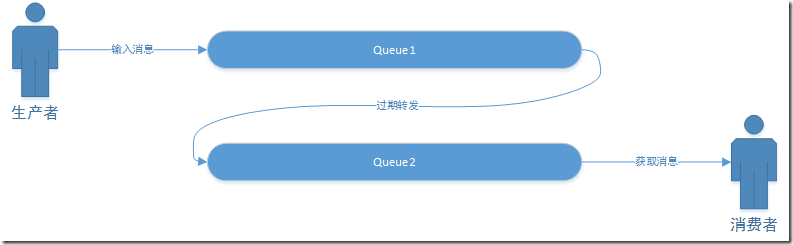
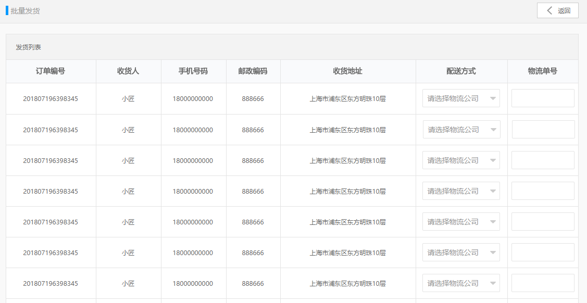

第13章 订单处理  

## 学习目标：

- 掌握rabbitmq的延迟消息的使用方法
- 完成批量发货功能，了解第三方物流系统
- 掌握SpringTask使用方法，完成自动收货功能


## 1. 超时未支付订单处理

### 1.1 需求分析

超过60分钟未支付的订单，我们需要进行超时订单的处理：先调用微信支付api，查询该订单的支付状态。如果未支付调用关闭订单的api，并修改订单状态为已关闭，并回滚库存数。如果该订单已经支付，做补偿操作（修改订单状态和记录）。

### 1.2 实现思路

如何获取超过60分钟的订单？我们可以使用延迟消息队列来实现。

所谓延迟消息队列，就是消息的生产者发送的消息并不会立刻被消费，而是在设定的时间之后才可以消费。

我们可以在订单创建时发送一个延迟消息，消息为订单号，系统会在60分钟后取出这个消息，然后查询订单的支付状态，根据结果做出相应的处理。

### 1.3 rabbitmq延迟消息 

使用RabbitMQ来实现延迟消息必须先了解RabbitMQ的两个概念：消息的TTL和死信Exchange，通过这两者的组合来实现上述需求。

#### 5.3.1 消息的TTL（Time To Live） 

消息的TTL就是消息的存活时间。RabbitMQ可以对队列和消息分别设置TTL。对队列设置就是队列没有消费者连着的保留时间，也可以对每一个单独的消息做单独的设置。超过了这个时间，我们认为这个消息就死了，称之为死信。

我们创建一个队列queue.temp，在Arguments 中添加x-message-ttl 为5000  （单位是毫秒），那所在压在这个队列的消息在5秒后会消失。

#### 5.3.2 死信交换器  Dead Letter Exchanges

一个消息在满足如下条件下，会进死信路由，记住这里是路由而不是队列，一个路由可以对应很多队列。

（1） 一个消息被Consumer拒收了，并且reject方法的参数里requeue是false。也就是说不会被再次放在队列里，被其他消费者使用。

（2）**上面的消息的TTL到了，消息过期了**。

（3）队列的长度限制满了。排在前面的消息会被丢弃或者扔到死信路由上。

Dead Letter Exchange其实就是一种普通的exchange，和创建其他exchange没有两样。只是在某一个设置Dead Letter Exchange的队列中有消息过期了，会自动触发消息的转发，发送到Dead Letter Exchange中去。




我们现在可以测试一下延迟队列。

（1）创建死信队列 

（2）创建交换机 

（3）建立交换器与队列之间的绑定 

（4）创建队列

代码实现

```java
package com.changgou.order.config;

import org.springframework.amqp.core.*;
import org.springframework.context.annotation.Bean;
import org.springframework.context.annotation.Configuration;

/****
 * @Author:lx
 * @Description:
 * @Date 2019/7/31 10:50
 *****/
@Configuration
public class RabbitMQConfig {


    //延迟消息
    public static final String RELAY_QUEUE = "relay_queue";
    //交换机名称
    public static final String CANCEL_ORDER_PAY_EXCHANGE = "cancel_order_pay_exchange";

    //队列名称
    public static final String CANCEL_ORDER_QUEUE = "cancel_order_queue";

    //延迟消息
    @Bean
    public Queue relayQueue(){
        return QueueBuilder.durable(RELAY_QUEUE)
                .withArgument("x-dead-letter-exchange",CANCEL_ORDER_PAY_EXCHANGE)
                .withArgument("x-dead-letter-routing-key","")
                .build();
    }


    @Bean
    public Queue cancelOrderQueue(){
        return new Queue(CANCEL_ORDER_QUEUE);
    }
    @Bean
    public DirectExchange directExchange(){
        return new DirectExchange(CANCEL_ORDER_PAY_EXCHANGE);
    }
    @Bean
    public Binding binding(){
        return BindingBuilder.bind(cancelOrderQueue()).to(directExchange()).with("");
    }


}

```

（5）测试：向死信队列添加消息，等待5秒后消息发送给交换机

```java
//发消息
rabbitTemplate.convertAndSend(RabbitMQConfig.RELAY_QUEUE, (Object)order.getId(), new MessagePostProcessor() {
    @Override
    public Message postProcessMessage(Message message) throws AmqpException {

        message.getMessageProperties().setExpiration("5000");//5秒
        return message;
    }
});

```

(6) 接收消息 

```java
    /**
     * 5分钟后  接收到消息
     * @param orderId
     */
    @RabbitListener(queues = {RabbitMQConfig.CANCEL_ORDER_QUEUE})
    public void cancelOrder(String orderId){

         System.out.println("接收到订单ID：" + orderId);
    }
```


### 1.4 代码实现 

#### 1.4.1 微信支付-关闭订单

（1）changgou_service_pay的WxPayService新增方法定义

```java

    /**
     * 关闭订单
     * @param orderId
     * @return
     */
    Map closeOrder(String orderId);

    /**
     * 查询订单
     * @param orderId
     * @return
     */
    Map queryOrder(String orderId);
```

（2）changgou_service_pay的 WxPayServiceImpl实现该方法

```java
@Override
public Map closeOrder(String orderId) {
	Map map=new HashMap(  );
	map.put( "out_trade_no",orderId );
	try {
		return  wxPay.closeOrder( map );
	} catch (Exception e) {
		e.printStackTrace();
		return null;
	}
}
@Override
public Map queryOrder(String orderId) {
    Map map=new HashMap(  );
    map.put( "out_trade_no",orderId );
    try {
        return  wxPay.orderQuery( map );
    } catch (Exception e) {
        e.printStackTrace();
        return null;
    }
}
```

（3）WxPayController新增方法

```java
    /**
     * 关闭微信订单
     * @param orderId
     * @return
     */
    @PutMapping("/close/{orderId}")
    public Map closeOrder(@PathVariable String orderId){
        return wxPayService.closeOrder( orderId );
    }

    /**
     * 查询微信订单
     * @param orderId
     * @return
     */
    @GetMapping("/query/{orderId}")
    public Map queryOrder(@PathVariable String orderId){
        return wxPayService.queryOrder( orderId );

    }
```

（4）changgou_service_pay_api的WxPayFeign新增方法

```java
    /**
     * 关闭微信订单
     * @param orderId
     * @return
     */
    @PutMapping("/wxpay/close/{orderId}")
    public Map closeOrder(@PathVariable("orderId") String orderId);


    /**
     * 查询微信订单
     * @param orderId
     * @return
     */
    @GetMapping("/wxpay/query/{orderId}")
    public Map queryOrder(@PathVariable("orderId") String orderId);
```

#### 1.4.2 恢复库存

changgou_service_goods  

```java
package com.changgou.goods.dao;

import com.changgou.pojo.OrderItem;
import com.changgou.pojo.Sku;
import org.apache.ibatis.annotations.Param;
import org.apache.ibatis.annotations.Update;
import tk.mybatis.mapper.common.Mapper;

import java.util.Map;

public interface SkuMapper extends Mapper<Sku> {


    //更新  扣减库存  增加销售量
    @Update("update tb_sku set num = num-#{num},sale_num = sale_num+#{num} where id = #{skuId} ")
    void decrStock(OrderItem orderItem);
    //更新  恢复库存  扣减销售量
    @Update("update tb_sku set num = num+#{num},sale_num = sale_num-#{num} where id = #{skuId} ")
    void incrStock(@Param(value = "skuId") String skuId, @Param(value = "num") Integer num);
}

```


SkuServiceImpl

```java

@Service
public class SkuServiceImpl implements SkuService {

    @Autowired
    private SkuMapper skuMapper;

    /**
     * 更新 恢复库存
     * @param stockMap
     */
    public void incrStock(Map<String,Integer> stockMap){
        Set<Map.Entry<String, Integer>> entries = stockMap.entrySet();
        for (Map.Entry<String, Integer> entry : entries) {

            skuMapper.incrStock(entry.getKey(),entry.getValue());
        }
    }
}
```

SkuController

```java
package com.changgou.goods.controller;
import com.changgou.entity.PageResult;
import com.changgou.entity.Result;
import com.changgou.entity.StatusCode;
import com.changgou.goods.service.SkuService;
import com.changgou.pojo.Sku;
import com.github.pagehelper.Page;
import org.springframework.beans.factory.annotation.Autowired;
import org.springframework.web.bind.annotation.*;
import java.util.List;
import java.util.Map;


@RestController
@CrossOrigin
@RequestMapping("/sku")
public class SkuController {


    @Autowired
    private SkuService skuService;


    //恢复库存
    @PutMapping("/incrStock")
    public void incrStock(@RequestBody Map<String,Integer> stockMap){
        skuService.incrStock(stockMap);
    }
}
```


```java
package com.changgou.goods.feign;

import com.changgou.pojo.Sku;
import org.springframework.cloud.openfeign.FeignClient;
import org.springframework.web.bind.annotation.*;

import java.util.List;
import java.util.Map;

@FeignClient(name = "goods")
@RequestMapping("/sku")
public interface SkuFeign {


    //恢复库存
    @PutMapping("/incrStock")
    public void incrStock(@RequestBody Map<String,Integer> stockMap);
}

```


#### 1.4.3 订单关闭逻辑

如果为未支付，查询微信订单，如果却为未支付，调用关闭本地订单（ 修改订单表的订单状态、记录订单日志、恢复商品表库存）和微信订单的逻辑，如果为已支付进行状态补偿。 

（1）changgou_service_order的OrderService新增方法定义

```java
/**
 * 关闭订单
 * @param orderId
 */
void closeOrder(String orderId);
```

（2）OrderServiceImpl实现该方法

```java
@Autowired
private WxPayFeign wxPayFeign;
@Autowired
private OrderLogMapper orderLogMapper;

@Override
public void closeOrder(String orderId) {
    System.out.println("关闭订单开启："+orderId);
    Order order = orderMapper.selectByPrimaryKey( orderId );


    //调用微信订单查询，检测支付状态
    Map wxQueryMap = wxPayFeign.queryOrder( orderId );
    System.out.println("查询微信支付订单："+wxQueryMap);

    if("SUCCESS".equals( wxQueryMap.get( "trade_state" ) ) ){ //如果支付状态是成功，进行补偿
        updateOrder(wxQueryMap);
        System.out.println("补偿");
    }
    if("NOTPAY".equals( wxQueryMap.get( "trade_state" ) ) ){  //如果是未支付，关闭订单
        System.out.println("执行关闭！");
        System.out.println("优先关闭微信支付！");
        //关闭微信订单
        wxPayFeign.closeOrder( orderId );

        System.out.println("再关闭订单状态！");

        order.setCloseTime( new Date(  ) );//关闭时间
        order.setOrderStatus( "4" );//关闭状态
        orderMapper.updateByPrimaryKeySelective( order );//更新


        //恢复库存和销量
        OrderItem orderItem=new OrderItem();
        orderItem.setOrderId( orderId );
        List<OrderItem> orderItemList = orderItemMapper.select(orderItem);
        Map<String,Integer> stockMap=new HashMap(  );
        for(OrderItem o:orderItemList){
            stockMap.put( o.getSkuId(),o.getNum() ); //负扣减
        }
        skuFeign.incrStock( stockMap );


        //记录订单变动日志
        OrderLog orderLog=new OrderLog();
        orderLog.setId( idWorker.nextId()+"" );
        orderLog.setOperater("system");// 系统
        orderLog.setOperateTime(new Date());//当前日期
        orderLog.setOrderStatus("4");
        orderLog.setOrderId(order.getId());
        orderLog.setPayStatus("0");
        orderLog.setConsignStatus("0");
        orderLogMapper.insertSelective(orderLog);
    }
}

//修改订单
public void updateOrder(Map map){

    Order order = orderMapper.selectByPrimaryKey(map.get("out_trade_no"));
    order.setUpdateTime(new Date());
    order.setPayTime(new Date());
    order.setTransactionId(String.valueOf(map.get("transaction_id")));
    order.setOrderStatus("1");
    order.setPayStatus("1");
    orderMapper.updateByPrimaryKeySelective(order);

    redisTemplate.delete(Constants.ORDER_PAY + order.getUsername());

}
```


#### 1.4.4 延迟消息处理

从消息队列中提取消息

（1）changgou_service_order新增依赖

```xml
<dependency>
	<groupId>com.changgou</groupId>
	<artifactId>changgou_service_pay_api</artifactId>
	<version>1.0-SNAPSHOT</version>
</dependency>
```

（2）changgou_service_order新建监听类

```java
package com.changgou.order.listener;

import com.alibaba.fastjson.JSON;
import com.alibaba.fastjson.JSONObject;
import com.changgou.order.config.RabbitMQConfig;
import com.changgou.order.service.OrderService;
import com.changgou.order.service.impl.OrderServiceImpl;
import org.springframework.amqp.rabbit.annotation.RabbitListener;
import org.springframework.beans.factory.annotation.Autowired;
import org.springframework.stereotype.Component;

import java.util.Map;


@Component
public class RabbitMQListener {


    @Autowired
    private OrderService orderService;


    /**
     * 60分钟后  订单取消
     * @param orderId
     */
    @RabbitListener(queues = {RabbitMQConfig.CANCEL_ORDER_QUEUE})
    public void cancelOrder(String orderId){
        System.out.println("接收到订单ID：" + orderId);
        orderService.closeOrder(orderId);
    }


}

```

（3）修改OrderServiceImpl的add方法，追加代码，实现mq发送

```java
//发消息
rabbitTemplate.convertAndSend(RabbitMQConfig.RELAY_QUEUE, (Object)order.getId(), new MessagePostProcessor() {
    @Override
    public Message postProcessMessage(Message message) throws AmqpException {

        message.getMessageProperties().setExpiration("5000");//5秒
        return message;
    }
});
```

#### 1.4.5 微服务之间权限问题解决

1）为了减库存，所以订单微服务要远程调用商品微服务，但是由于是MQ的消息监听器触发的调用，是没有用户信息的，没有权限调用商品微服务的减库存方法，所以要打开商品微服务对减库存方法的限制


```java
package com.changgou.goods.config;

import org.springframework.context.annotation.Bean;
import org.springframework.context.annotation.Configuration;
import org.springframework.core.io.ClassPathResource;
import org.springframework.core.io.Resource;
import org.springframework.security.config.annotation.method.configuration.EnableGlobalMethodSecurity;
import org.springframework.security.config.annotation.web.builders.HttpSecurity;
import org.springframework.security.oauth2.config.annotation.web.configuration.EnableResourceServer;
import org.springframework.security.oauth2.config.annotation.web.configuration.ResourceServerConfigurerAdapter;
import org.springframework.security.oauth2.provider.token.TokenStore;
import org.springframework.security.oauth2.provider.token.store.JwtAccessTokenConverter;
import org.springframework.security.oauth2.provider.token.store.JwtTokenStore;

import java.io.BufferedReader;
import java.io.IOException;
import java.io.InputStreamReader;
import java.util.stream.Collectors;

@Configuration
@EnableResourceServer
//开启方法上的PreAuthorize注解
@EnableGlobalMethodSecurity(prePostEnabled = true, securedEnabled = true)
public class ResourceServerConfig extends ResourceServerConfigurerAdapter {
	
	
	//....................略
    /***
     * Http安全配置，对每个到达系统的http请求链接进行校验
     * @param http
     * @throws Exception
     */
    @Override
    public void configure(HttpSecurity http) throws Exception {
        //所有请求必须认证通过
        http.authorizeRequests()
                .antMatchers("/sku/incrStock") //打开减库存
                .permitAll()
                .anyRequest().
                authenticated();    //其他地址需要认证授权
    }
}
```

2）订单微服务调用支付微服务，为了关闭微信订单及查询微信订单状态，所以也要打开微服务的权限限制

```java
package com.changgou.pay.config;

import org.springframework.context.annotation.Bean;
import org.springframework.context.annotation.Configuration;
import org.springframework.core.io.ClassPathResource;
import org.springframework.core.io.Resource;
import org.springframework.security.config.annotation.method.configuration.EnableGlobalMethodSecurity;
import org.springframework.security.config.annotation.web.builders.HttpSecurity;
import org.springframework.security.oauth2.config.annotation.web.configuration.EnableResourceServer;
import org.springframework.security.oauth2.config.annotation.web.configuration.ResourceServerConfigurerAdapter;
import org.springframework.security.oauth2.provider.token.TokenStore;
import org.springframework.security.oauth2.provider.token.store.JwtAccessTokenConverter;
import org.springframework.security.oauth2.provider.token.store.JwtTokenStore;

import java.io.BufferedReader;
import java.io.IOException;
import java.io.InputStreamReader;
import java.util.stream.Collectors;

@Configuration
@EnableResourceServer
//开启方法上的PreAuthorize注解
@EnableGlobalMethodSecurity(prePostEnabled = true, securedEnabled = true)
public class ResourceServerConfig extends ResourceServerConfigurerAdapter {

    //...................略
    /***
     * Http安全配置，对每个到达系统的http请求链接进行校验
     * @param http
     * @throws Exception
     */
    @Override
    public void configure(HttpSecurity http) throws Exception {
        //所有请求必须认证通过
        http.authorizeRequests()
                .antMatchers("/wxpay/notify","/wxpay/close/{orderId}","/wxpay/query/{orderId}")
                .permitAll()
                .anyRequest().
                authenticated();    //其他地址需要认证授权
    }
}
```

### 1.4.6 测试

添加商品路径:

http://web.changgou.com:8001/api/wcart/add?skuId=100000015158&num=1

登录并添加商品路径:

http://web.changgou.com:8001/api/oauth/toLogin?ReturnUrl=http://web.changgou.com:8001/api/wcart/add?skuId=100000015158&num=1

## 2. 订单批量发货

### 2.1 批量发货业务逻辑

#### 2.1.1 需求分析

实现批量发货的业务逻辑



#### 2.1.2 代码实现

（1）OrderService新增方法定义

```java
/**
 * 批量发货
 * @param orders
 */
void batchSend(List<Order> orders);
```

（2）OrderServiceImpl实现该方法

```java
@Override
public void batchSend(List<Order> orders) {
	//判断运单号和物流公司是否为空
	for(Order order :orders){
		if(order.getShippingCode()==null || order.getShippingName()==null){
			throw new RuntimeException("请选择快递公司和填写快递单号");
		}
		if(order.getId()==null){
			throw new RuntimeException("订单号为空");
		}
	}

	//循环订单,进行状态校验
	for(Order order :orders){
		Order order1 = orderMapper.selectByPrimaryKey( order.getId() );
		if(!"0".equals( order1.getConsignStatus() ) || !"1".equals( order1.getOrderStatus() )  ){
			throw new RuntimeException("订单状态有误！");
		}
	}

	//循环订单更新操作
	for(Order order :orders){
		order.setOrderStatus("2");//订单状态  已发货
		order.setConsignStatus("1"); //发货状态  已发货
		order.setConsignTime(new Date());//发货时间
		order.setUpdateTime( new Date());//更新时间
		orderMapper.updateByPrimaryKeySelective(order);
		//记录订单变动日志
		OrderLog orderLog=new OrderLog();
		orderLog.setId( idWorker.nextId()+"" );
		orderLog.setOperateTime(new Date());//当前日期
		orderLog.setOperater( "admin" );//系统管理员
		orderLog.setOrderStatus("2"); //已完成
		orderLog.setConsignStatus( "1" );//发状态（0未发货 1已发货）
		orderLog.setOrderId(order.getId());
		orderLogMapper.insertSelective( orderLog );
	}
}
```

（3）OrderController新增方法

```java
/**
 * 批量发货
 * @param orders  订单列表
 */
@PostMapping("/batchSend")
public Result batchSend( @RequestBody List<Order> orders){
	orderService.batchSend( orders );
	return new Result( true,StatusCode.OK,"发货成功" );
}
```


### 2.2 对接第三方物流（了解） 

当我们在电商平台购买了商品后，一般会非常关心商品的物流轨迹。那这些信息是如何获取的呢？我们需要对接第三方的物流系统。比较常用的有菜鸟物流、快递鸟等。

我们这里推荐使用快递鸟  http://www.kdniao.com

我们可以使用快递鸟提供的以下接口：

（1）预约取件API  

预约取件API为用户提供了在线下单，预约快递员上门揽件的功能，为用户解决在线发货需求。

我们可以在实现批量发货功能后调用预约取件API  

（2）即时查询API

物流查询API提供实时查询物流轨迹的服务，用户提供运单号和快递公司，即可查询当前时刻的最新物流轨迹。

用户可以在用户中心调用此API完成物流信息的查询，电商平台也可以调用此API完成运单的跟踪。


## 3. 确认收货与自动收货 

### 3.1 确认收货

#### 3.1.1 需求分析与实现思路


#### 3.1.2 代码实现

（1）OrderService新增方法定义

```java
/**
 * 确认收货
 * @param orderId
 * @param operator
 */
void take(String orderId,String operator);
```

（2）OrderServiceImpl实现该方法

```java
@Override
public void take(String orderId, String operator) {
	Order order = orderMapper.selectByPrimaryKey( orderId );
	if(order==null){
		throw new RuntimeException("订单不存在");
	}
	if( !"1".equals( order.getConsignStatus())){
		throw new RuntimeException("订单未发货");
	}
	order.setOrderStatus("3");//已完成
	order.setUpdateTime(new Date());
	order.setEndTime(new Date());//交易结束
	orderMapper.updateByPrimaryKeySelective(order);
	//记录订单变动日志
	OrderLog orderLog=new OrderLog();
	orderLog.setId(idWorker.nextId()+"");
	orderLog.setOperateTime(new Date());//当前日期
	orderLog.setOperater(operator);//系统？管理员？用户？
	orderLog.setOrderStatus("3");
	orderLog.setOrderId(order.getId());
	orderLogMapper.insertSelective(orderLog);
}
```

（3）OrderController新增方法

```java
/**
 * 确认收货 
 * @param orderId  订单号
 * @param operator 操作者
 * @return
 */
@PutMapping("/take/{orderId}/operator/{operator}")
public Result take(@PathVariable String orderId, @PathVariable String operator){
	orderService.take( orderId,operator );
	return new Result( true,StatusCode.OK,"" );
}
```

### 3.2 自动收货处理

#### 3.2.1 需求分析

如果用户在15天（可以在订单配置表中配置）没有确认收货，系统将自动收货。如果实现？我们这里采用定时任务springTask来实现。

#### 3.2.2 SpringTask快速入门

Spring3.0以后自主开发的定时任务工具，spring-task，可以将它比作一个轻量级的Quartz，而且使用起来很简单，除spring相关的包外不需要额外的包，而且支持注解和配置文件两种形式。

测试代码，每间隔一秒自动输出

（1）创建工程changgou_task，引入依赖

```xml
<dependency>
	<groupId>org.springframework.boot</groupId>
	<artifactId>spring-boot-starter</artifactId>
</dependency>
```

（2）创建配置文件

```yaml
server:
  port: 9202
spring:
  application:
    name: task
```

（3）创建启动类

```java
@SpringBootApplication
@EnableScheduling
public class TaskApplication {

    public static void main(String[] args) {
        SpringApplication.run( TaskApplication.class,args );
    }
}
```

`@EnableScheduling` 注解用于开启任务调度

（2）创建com.changgou.task包，包下创建类OrderTask

```java
/**
 * 定时处理
 */
@Component
public class OrderTask {

    @Scheduled(cron = "* * * * * ?")
    public void autoTake(){
        System.out.println(new Date());
    }
}
```

运行，就可以看到每秒在控制台输出当前时间

#### 3.2.3 Cron表达式

Cron表达式是一个字符串，字符串以5或6个空格隔开，分为6或7个域，每一个域代表一个含义。

Cron表达式7个域格式为：  秒 分 小时 日 月 周 年   

Cron表达式6个域格式为：  秒 分 小时 日 月 周  

| 序号   | 说明   | 是否必填 | 允许填写的值           | 允许的通配符        |
| ---- | ---- | ---- | ---------------- | ------------- |
| 1    | 秒    | 是    | 0-59             | , - * /       |
| 2    | 分    | 是    | 0-59             | , - * /       |
| 3    | 小时   | 是    | 0-23             | , - * /       |
| 4    | 日    | 是    | 1-31             | , - * ? / L W |
| 5    | 月    | 是    | 1-12或JAN-DEC     | , - * /       |
| 6    | 周    | 是    | 1-7或SUN-SAT      | , - * ? / L W |
| 7    | 年    | 否    | empty 或1970-2099 | , - * /       |

使用说明：

```properties
通配符说明:
* 表示所有值. 例如:在分的字段上设置 "*",表示每一分钟都会触发。

? 表示不指定值。使用的场景为不需要关心当前设置这个字段的值。

例如:要在每月的10号触发一个操作，但不关心是周几，所以需要周位置的那个字段设置为"?" 具体设置为 0 0 0 10 * ?

- 表示区间。例如 在小时上设置 "10-12",表示 10,11,12点都会触发。

, 表示指定多个值，例如在周字段上设置 "MON,WED,FRI" 表示周一，周三和周五触发

/ 用于递增触发。如在秒上面设置"5/15" 表示从5秒开始，每增15秒触发(5,20,35,50)。 在月字段上设置'1/3'所示每月1号开始，每隔三天触发一次。

L 表示最后的意思。在日字段设置上，表示当月的最后一天(依据当前月份，如果是二月还会依据是否是润年[leap]), 在周字段上表示星期六，相当于"7"或"SAT"。如果在"L"前加上数字，则表示该数据的最后一个。例如在周字段上设置"6L"这样的格式,则表示“本月最后一个星期五"

W 表示离指定日期的最近那个工作日(周一至周五). 例如在日字段上设置"15W"，表示离每月15号最近的那个工作日触发。如果15号正好是周六，则找最近的周五(14号)触发, 如果15号是周未，则找最近的下周一(16号)触发.如果15号正好在工作日(周一至周五)，则就在该天触发。如果指定格式为 "1W",它则表示每月1号往后最近的工作日触发。如果1号正是周六，则将在3号下周一触发。(注，"W"前只能设置具体的数字,不允许区间"-").

# 序号(表示每月的第几个周几)，例如在周字段上设置"6#3"表示在每月的第三个周六.注意如果指定"#5",正好第五周没有周六，则不会触发该配置(用在母亲节和父亲节再合适不过了) ；
```

常用表达式

```properties
0 0 10,14,16 * * ? 每天上午10点，下午2点，4点 
0 0/30 9-17 * * ? 朝九晚五工作时间内每半小时 
0 0 12 ? * WED 表示每个星期三中午12点 
"0 0 12 * * ?" 每天中午12点触发 
"0 15 10 ? * *" 每天上午10:15触发 
"0 15 10 * * ?" 每天上午10:15触发 
"0 15 10 * * ? *" 每天上午10:15触发 
"0 15 10 * * ? 2005" 2005年的每天上午10:15触发 
"0 * 14 * * ?" 在每天下午2点到下午2:59期间的每1分钟触发 
"0 0/5 14 * * ?" 在每天下午2点到下午2:55期间的每5分钟触发 
"0 0/5 14,18 * * ?" 在每天下午2点到2:55期间和下午6点到6:55期间的每5分钟触发 
"0 0-5 14 * * ?" 在每天下午2点到下午2:05期间的每1分钟触发 
"0 10,44 14 ? 3 WED" 每年三月的星期三的下午2:10和2:44触发 
"0 15 10 ? * MON-FRI" 周一至周五的上午10:15触发 
"0 15 10 15 * ?" 每月15日上午10:15触发 
"0 15 10 L * ?" 每月最后一日的上午10:15触发 
"0 15 10 ? * 6L" 每月的最后一个星期五上午10:15触发 
"0 15 10 ? * 6L 2002-2005" 2002年至2005年的每月的最后一个星期五上午10:15触发 
"0 15 10 ? * 6#3" 每月的第三个星期五上午10:15触发
```

#### 3.2.4 代码实现

（1）OrderService新增方法定义

```java
/**
 * 自定确认收货
 */
void autoTack();
```

（2）OrderServiceImpl实现此方法

```java
@Override
public void autoTack() {
	//读取订单配置信息
	OrderConfig orderConfig = orderConfigMapper.selectByPrimaryKey( 1 );

	//获得时间节点
	LocalDate now = LocalDate.now();//当前日期
	//获取过期的时间节点，在这个日期前发货的未收货订单都算超时
	LocalDate date =now.plusDays( -orderConfig.getTakeTimeout() );
	System.out.println(date);

	//按条件查询过期订单
	Example example=new Example( Order.class );
	Example.Criteria criteria = example.createCriteria();
	criteria.andLessThan( "consignTime", date);
	criteria.andEqualTo( "orderStatus","2" );

	List<Order> orders = orderMapper.selectByExample( example );
	for(Order order:orders){
		System.out.println("过期订单："+order.getId()+" "+order.getConsignStatus());
		take(order.getId(),"system" );
	}
}
```

（3）OrderController新增方法（方便测试）

```java
@GetMapping("/autoTack")
public Result autoTack(){
	orderService.autoTack();
	return new Result( true,StatusCode.OK,"" );
}
```

（4）编写消息监听类

```java
@Component
@RabbitListener(queues = "order_tack")
public class OrderTackListener {

    @Autowired
    private OrderService orderService;

    @RabbitHandler
    public void autoTack(String message){
        System.out.println("收到自动确认收货消息");
        orderService.autoTack(); //自动确认收货
    }
}
```

（5）changgou_task引入rabbitmq依赖

```xml
<dependency>
	<groupId>org.springframework.amqp</groupId>
	<artifactId>spring-rabbit</artifactId>
</dependency>
```

修改OrderTask

```java
@Component
public class OrderTask {

    @Autowired
    private RabbitTemplate rabbitTemplate;

    /**
     * 订单自动收货
     */
    @Scheduled(cron = "0 0 0 * * ?")
    public void autoTake(){
        System.out.println(new Date());
        rabbitTemplate.convertAndSend("","order_tack","-" );
    }

}
```

