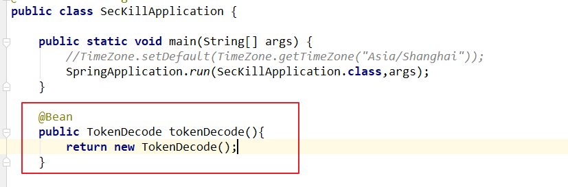
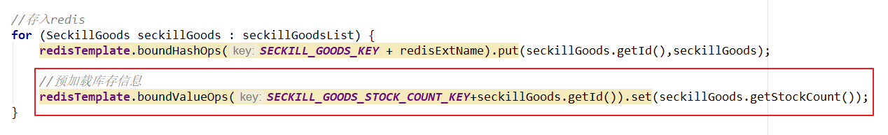
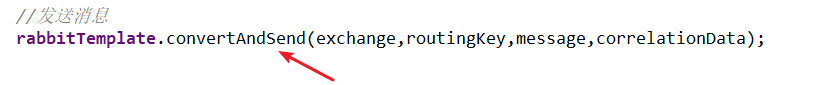
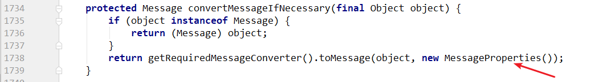
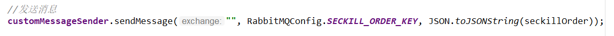

# 第15章-秒杀后端

## 1 秒杀异步下单

​	用户在下单的时候，需要基于JWT令牌信息进行登陆人信息认证，确定当前订单是属于谁的。

​	针对秒杀的特殊业务场景，仅仅依靠对象缓存或者页面静态化等技术去解决服务端压力还是远远不够。对于数据库压力还是很大，所以需要异步下单，异步是最好的解决办法，但会带来一些额外的程序上的复杂性。

### 1.1 秒杀服务-下单实现

**1）将tokenDecode工具类放入秒杀服务并声明Bean, changgou_service_seckill服务**




**2）更新秒杀服务启动类，添加redis配置**

changgou_service_seckill服务

```java
/**
     * 设置 redisTemplate 的序列化设置
     * @param redisConnectionFactory
     * @return
     */
@Bean
public RedisTemplate<Object, Object> redisTemplate(RedisConnectionFactory redisConnectionFactory) {
    // 1.创建 redisTemplate 模版
    RedisTemplate<Object, Object> template = new RedisTemplate<>();
    // 2.关联 redisConnectionFactory
    template.setConnectionFactory(redisConnectionFactory);
    // 3.创建 序列化类
    GenericToStringSerializer genericToStringSerializer = new GenericToStringSerializer(Object.class);
    // 6.序列化类，对象映射设置
    // 7.设置 value 的转化格式和 key 的转化格式
    template.setValueSerializer(genericToStringSerializer);
    template.setKeySerializer(new StringRedisSerializer());
    template.afterPropertiesSet();
    return template;
}
```

**2）新建下单controller并声明方法**

changgou_service_seckill服务

```java
@RestController
@CrossOrigin
@RequestMapping("/seckillorder")
public class SecKillOrderController {

    @Autowired
    private TokenDecode tokenDecode;

    @Autowired
    private SecKillOrderService secKillOrderService;

    /**
     * 秒杀下单
     * @param time 当前时间段
     * @param id 秒杀商品id
     * @return
     */
    @RequestMapping("/add")
    public Result add(@RequestParam("time") String time, @RequestParam("id") Long id){

        //获取当前登陆人
        String username = tokenDecode.getUserInfo().get("username");

        boolean result = secKillOrderService.add(id,time,username);

        if (result){
            return new Result(true, StatusCode.OK,"下单成功");
        }else{
            return new Result(false,StatusCode.ERROR,"下单失败");
        }
    }
}
```

**3) 新建service接口**

changgou_service_seckill服务

```java
public interface SecKillOrderService {
    /**
     * 秒杀下单
     * @param id 商品id
     * @param time 时间段
     * @param username 登陆人姓名
     * @return
     */
    boolean add(Long id, String time, String username);
}
```

**4）更改预加载秒杀商品**

​	当预加载秒杀商品的时候，提前加载每一个商品的库存信息，后续减库存操作也会先**预扣减缓存中的库存再异步扣减mysql数据**。

​	预扣减库存会基于redis原子性操作实现



```java
@Service
public class SecKillGoodsServiceImpl implements SecKillGoodsService {

    @Autowired
    private RedisTemplate redisTemplate;

    @Override
    public List<SeckillGoods> list(String time) {
        List<SeckillGoods> secKillGoodsList = redisTemplate.boundHashOps(Constants.SECKILL_GOODS_KEY + time).values();

        //更新商品库存信息的数据来源
        for (SeckillGoods seckillGoods : secKillGoodsList) {
            //获取redis中的秒杀商品库存数量, 放入秒杀商品对象中
            String value = (String) redisTemplate.opsForValue().get(Constants.SECKILL_GOODS_STOCK_COUNT_KEY+seckillGoods.getId());
            seckillGoods.setStockCount(Integer.parseInt(value));
        }

        return secKillGoodsList;
    }
}
```


**5）秒杀下单业务层实现**

业务逻辑：

获取秒杀商品数据与库存量数据，如果没有库存则抛出异常

预扣减库存，如果扣完库存量<0，删除商品数据与库存数据

如果库存量>=0，创建秒杀订单，并存入redis

基于mq异步方式完成与mysql数据同步（最终一致性）

**注意：库存数据从redis中取出，转换成String**

```java
@Service
public class SecKillOrderServiceImpl implements SecKillOrderService {

    @Autowired
    private RedisTemplate redisTemplate;

    @Autowired
    private IdWorker idWorker;

    @Autowired
    private CustomMessageSender customMessageSender;

    /**
     * 秒杀下单
     * @param id 商品id
     * @param time 时间段
     * @param username 登陆人姓名
     * @return
     */
    @Override
    public boolean add(Long id, String time, String username) {
	   /**
         * 获取秒杀商品数据与库存量数据，如果没有库存则抛出异常
         * 预扣减库存，如果扣完库存量<0，删除商品数据与库存数据
         * 如果库存量>=0，创建秒杀订单
         * 基于mq异步方式完成与mysql数据同步（最终一致性）
         */
        
        //获取redis中的商品信息
        SeckillGoods seckillGoods = (SeckillGoods) redisTemplate.boundHashOps(Constants.SECKILL_GOODS_KEY+time).get(id);
        if (seckillGoods == null){
            return false;
        }

        //获取redis中库存信息
        String stockCount = (String) redisTemplate.opsForValue().get(Constants.SECKILL_GOODS_STOCK_COUNT_KEY+seckillGoods.getId());
        int redisStockCount = Integer.parseInt(stockCount);
        if (redisStockCount<=0){
            return false;
        }

        //预扣减库存，如果扣完库存量<0，删除商品数据与库存数据 (原子性操作)
        //redis原子性操作
        // 1） incr,decr
        Long decrement = redisTemplate.opsForValue().decrement(Constants.SECKILL_GOODS_STOCK_COUNT_KEY + seckillGoods.getId());
        if (decrement<0){

            //库存没了
            //删除商品信息
            redisTemplate.boundHashOps(Constants.SECKILL_GOODS_KEY+time).delete(id);

            //删除库存信息
            redisTemplate.delete(Constants.SECKILL_GOODS_STOCK_COUNT_KEY+id);
            return false;
        }

        //创建订单信息
        seckillOrder = new SeckillOrder();
        seckillOrder.setId(idWorker.nextId());
        seckillOrder.setSeckillId(id);
        seckillOrder.setMoney(seckillGoods.getCostPrice());
        seckillOrder.setUserId(username);
        seckillOrder.setSellerId(seckillGoods.getSellerId());
        seckillOrder.setCreateTime(new Date());
        seckillOrder.setStatus("0");

        //发送消息(消息必达)

        return true;
    }
}
```

### 1.2 生产者保证消息不丢失

​	按照现有rabbitMQ的相关知识，生产者会发送消息到达消息服务器。但是在实际生产环境下，消息生产者发送的消息很有可能当到达了消息服务器之后，由于消息服务器的问题导致消息丢失，如宕机。因为消息服务器默认会将消息存储在内存中。一旦消息服务器宕机，则消息会产生丢失。因此要保证生产者的消息不丢失，要开始持久化策略。

```properties
rabbitMQ持久化：
	1. 交换机持久化
	2. 队列持久化
	3. 消息持久化
```

​	但是如果仅仅只是开启这两部分的持久化，也很有可能造成消息丢失。因为消息服务器很有可能在持久化的过程中出现宕机。因此需要通过数据保护机制来保证消息一定会成功进行持久化，否则将一直进行消息发送。

```properties
RabbitMQ数据保护机制
  事务机制
    事务机制采用类数据库的事务机制进行数据保护，当消息到达消息服务器，首先会开启一个事务，接着进行数据磁盘持久化，只有持久化成功才会进行事务提交，向消息生产者返回成功通知，消息生产者一旦接收成功通知则不会再发送此条消息。当出现异常，则返回失败通知.消息生产者一旦接收失败通知，则继续发送该条消息。
    事务机制虽然能够保证数据安全，但是此机制采用的是同步机制，会产生系统间消息阻塞，影响整个系统的消息吞吐量。从而导致整个系统的性能下降，因此不建议使用。
  confirm机制
    confirm模式需要基于channel进行设置, 一旦某条消息被投递到队列之后,消息队列就会发送一个确认信息给生产者,如果队列与消息是可持久化的, 那么确认消息会等到消息成功写入到磁盘之后发出.
	confirm的性能高,主要得益于它是异步的.生产者在将第一条消息发出之后等待确认消息的同时也可以继续发送后续的消息.当确认消息到达之后,就可以通过回调方法处理这条确认消息. 如果MQ服务宕机了,则会返回nack消息. 生产者同样在回调方法中进行后续处理。
```

#### 1.2.1 开启confirm机制

**changgou_service_seckill服务**

**1）更改秒杀服务配置文件**

```yml
rabbitmq:
    host: 192.168.200.128
    publisher-confirms: true #开启confirm机制
```

**2）开启队列持久化**

```java
@Configuration
public class RabbitMQConfig {

    //秒杀商品订单消息
    public static final String SECKILL_ORDER_KEY="seckill_order";

    //声明队列，并开启持久化
    @Bean
    public Queue queue(){
        /**
         * 第一个参数：队列名称
         * 第二个参数：是否开启队列持久化
         */
        return new Queue(SECKILL_ORDER_KEY,true);
    }
}
```

**3）消息持久化源码查看**







**4）增强rabbitTemplate**

```java
/**
 * 自定义消息发送类
 * 增强RabbitTemplate
 * @author ZJ
 */
@Component
public class CustomMessageSender implements RabbitTemplate.ConfirmCallback{

    static final Logger log = LoggerFactory.getLogger(CustomMessageSender.class);

    private static final String MESSAGE_CONFIRM_="message_confirm_";

    @Autowired
    private RabbitTemplate rabbitTemplate;

    @Autowired
    private RedisTemplate redisTemplate;

    /**
     * 构造方法
     * @param rabbitTemplate
     */
    public CustomMessageSender(RabbitTemplate rabbitTemplate) {
        this.rabbitTemplate = rabbitTemplate;
        rabbitTemplate.setConfirmCallback(this);
    }

    /**
     * 生产者通知回调方法
     * @param correlationData 唯一标识
     * @param ack 成功/失败
     * @param cause
     */
    @Override
    public void confirm(CorrelationData correlationData, boolean ack, String cause) {
        if (ack){
            //返回成功通知
            //删除redis中的相关数据
            redisTemplate.delete(correlationData.getId());
            redisTemplate.delete(MESSAGE_CONFIRM_+correlationData.getId());
        }else{
            //返回失败通知
            Map<String,String> map =(Map<String,String>)redisTemplate.opsForHash().entries(MESSAGE_CONFIRM_ + correlationData.getId());
            String exchange = map.get("exchange");
            String routingKey = map.get("routingKey");
            String sendMessage = map.get("sendMessage");

            //重新发送
            rabbitTemplate.convertAndSend(exchange,routingKey, JSON.toJSONString(sendMessage));
        }
    }

    /**
     * 自定义发送方法
     * @param exchange      交换器
     * @param routingKey    路由键
     * @param message       消息内容
     */
    public void sendMessage(String exchange,String routingKey,String message){

        //设置消息唯一标识并存入缓存
        CorrelationData correlationData = new CorrelationData(UUID.randomUUID().toString());
        redisTemplate.opsForValue().set(correlationData.getId(),message);

        //本次发送到相关元信息存入缓存
        Map<String, String> map = new HashMap<>();
        map.put("exchange", exchange);
        map.put("routingKey", routingKey);
        map.put("sendMessage", message);
        redisTemplate.opsForHash().putAll(MESSAGE_CONFIRM_+correlationData.getId(), map);

        //携带唯一标识发送消息
        rabbitTemplate.convertAndSend(exchange, routingKey, message, correlationData);
    }
}
```

**5）发送消息**

更改下单业务层实现

changgou_service_seckill服务SecKillOrderServiceImpl类

```java
@Autowired
private CustomMessageSender customMessageSender;

@Override
public boolean add(Long id, String time, String username) { 
	//发送消息(消息必达)
    customMessageSender.sendMessage("", RabbitMQConfig.SECKILL_ORDER, JSON.toJSONString(seckillOrder));
}
```




### 1.3 秒杀下单服务更新库存库

#### 1.3.1 异步下单服务changgou_service_consume

**1）添加依赖**

```xml
<dependencies>
    <dependency>
        <groupId>com.changgou</groupId>
        <artifactId>changgou_common_db</artifactId>
        <version>1.0-SNAPSHOT</version>
    </dependency>
    <dependency>
        <groupId>org.springframework.cloud</groupId>
        <artifactId>spring-cloud-starter-netflix-eureka-client</artifactId>
    </dependency>
    <dependency>
        <groupId>com.changgou</groupId>
        <artifactId>changgou_service_order_api</artifactId>
        <version>1.0-SNAPSHOT</version>
    </dependency>
    <dependency>
        <groupId>com.changgou</groupId>
        <artifactId>changgou_service_seckill_api</artifactId>
        <version>1.0-SNAPSHOT</version>
    </dependency>
    <dependency>
        <groupId>com.changgou</groupId>
        <artifactId>changgou_service_goods_api</artifactId>
        <version>1.0-SNAPSHOT</version>
    </dependency>
    <dependency>
        <groupId>org.springframework.amqp</groupId>
        <artifactId>spring-rabbit</artifactId>
    </dependency>
</dependencies>
```

**2）新建application.yml**

```yml
server:
  port: 9022
spring:
  jackson:
    time-zone: GMT+8
  application:
    name: sec-consume
  datasource:
    driver-class-name: com.mysql.jdbc.Driver
    url: jdbc:mysql://192.168.200.128:3306/changgou_seckill?useUnicode=true&characterEncoding=utf-8&useSSL=false&allowMultiQueries=true&serverTimezone=GMT%2b8
    username: root
    password: root
  main:
    allow-bean-definition-overriding: true #当遇到同样名字的时候，是否允许覆盖注册
  redis:
    host: 192.168.200.128
  rabbitmq:
    host: 192.168.200.128
    listener:
      simple:
        acknowledge-mode: manual #手动
eureka:
  client:
    service-url:
      defaultZone: http://127.0.0.1:6868/eureka
  instance:
    prefer-ip-address: true
feign:
  hystrix:
    enabled: true
  client:
    config:
      default:   #配置全局的feign的调用超时时间  如果 有指定的服务配置 默认的配置不会生效
        connectTimeout: 60000 # 指定的是 消费者 连接服务提供者的连接超时时间 是否能连接  单位是毫秒
        readTimeout: 20000  # 指定的是调用服务提供者的 服务 的超时时间（）  单位是毫秒
#hystrix 配置
hystrix:
  command:
    default:
      execution:
        timeout:
          #如果enabled设置为false，则请求超时交给ribbon控制
          enabled: true
        isolation:
          strategy: SEMAPHORE
          thread:
            # 熔断器超时时间，默认：1000/毫秒
            timeoutInMilliseconds: 20000
```

**3）新建启动类**

```java
@SpringBootApplication
@EnableDiscoveryClient
@MapperScan(basePackages = {"com.changgou.consume.dao"})
public class OrderConsumerApplication {

    public static void main(String[] args) {
        SpringApplication.run(OrderConsumerApplication.class,args);
    }
}
```

#### 1.3.2 消费者手动ACK下单实现

​	按照现有RabbitMQ知识，可以得知当消息消费者成功接收到消息后，会进行消费并自动通知消息服务器将该条消息删除。此种方式的实现使用的是消费者自动应答机制。但是此种方式非常的不安全。

​	在生产环境下，当消息消费者接收到消息，很有可能在处理消息的过程中出现意外情况从而导致消息丢失，因为如果使用自动应答机制是非常不安全。

​	我们需要确保消费者当把消息成功处理完成之后，消息服务器才会将该条消息删除。此时要实现这种效果的话，就需要将**自动应答转换为手动应答**,只有在消息消费者将消息处理完，才会通知消息服务器将该条消息删除。

**1）更改配置文件**

```yml
rabbitmq:
    host: 192.168.200.128
    listener:
      simple:
        acknowledge-mode: manual #手动
```

**2）定义监听类**

changgou_service_consume服务

```java
@Component
public class SecKillOrderListener {

    @Autowired
    private SecKillOrderService secKillOrderService;

    @RabbitListener(queues = RabbitMQConfig.SECKILL_ORDER)
    public void receiveSecKillOrderMessage(Channel channel, Message message){

        //预抓取总数
        try {
            channel.basicQos(300);
        } catch (IOException e) {
            e.printStackTrace();
        }

        //将消息转换为秒杀订单对象
        SeckillOrder seckillOrder = JSON.parseObject(message.getBody(), SeckillOrder.class);

        //同步mysql，存储订单信息，扣减秒杀商品库存
        int rows = secKillOrderService.createOrder(seckillOrder);
        if (rows>0){
            /**
             * 更新数据库操作成功
             * 消费者发起成功通知
             * DeliveryTag: 消息的唯一标识  channel+消息编号
             * 第二个参数：是否开启批量处理 false:不开启批量
             */
            try {
                channel.basicAck(message.getMessageProperties().getDeliveryTag(),false);
            } catch (IOException e) {
                e.printStackTrace();
            }
        }else{
            /**
             * 返回失败通知
             * 第一个boolean true所有消费者都会拒绝这个消息，false代表只有当前消费者拒绝
             * 第二个boolean true当前消息会进入到死信队列，false重新回到原有队列中，默认回到头部
             */
            try {
                channel.basicNack(message.getMessageProperties().getDeliveryTag(),false,false);
            } catch (IOException e) {
                e.printStackTrace();
            }
        }

    }
}
```

3）定义业务层接口与实现类

```java
public interface SecKillOrderService {
    int createOrder(SeckillOrder seckillOrder);
}
```

```java
@Service
public class SecKillOrderServiceImpl implements SecKillOrderService  {

    @Autowired
    private SeckillGoodsMapper seckillGoodsMapper;

    @Autowired
    private SeckillOrderMapper seckillOrderMapper;

    /**
     * 同步数据库，更改库存，添加订单
     * @param seckillOrder
     * @return
     */
    @Override
    @Transactional
    public int createOrder(SeckillOrder seckillOrder) {

        //更改库存
        int result = seckillGoodsMapper.updateStockCountById(seckillOrder.getSeckillId());
        if (result<=0){
            return result;
        }

        //添加订单
        result = seckillOrderMapper.insertSelective(seckillOrder);
        if (result<=0){
            return result;
        }
        return result;
    }

}
```

```properties
数据库字段unsigned介绍
	unsigned-----无符号，修饰int 、char
	
ALTER TABLE tb_seckill_goods MODIFY COLUMN stock_count int(11) UNSIGNED DEFAULT NULL COMMENT '剩余库存数';
```

### 1.5 流量削峰

​	在秒杀这种高并发的场景下，每秒都有可能产生几万甚至十几万条消息，如果没有对消息处理量进行任何限制的话，很有可能因为过多的消息堆积从而导致消费者宕机的情况。因此官网建议对每一个消息消费者都设置处理消息总数（**消息抓取总数**）。

​	消息抓取总数的值，设置过大或者过小都不好，过小的话，会导致整个系统消息吞吐能力下降，造成性能浪费。过大的话，则很有可能导致消息过多，导致整个系统OOM(out of memory)内存溢出。因此官网建议每一个消费者将该值设置在100-300之间。

1）更新消费者。

changgou_service_consume服务SecKillOrderListener监听器

```java
/**
  * 预抓取总数
  */
try {
    channel.basicQos(300);
} catch (IOException e) {
    e.printStackTrace();
}
```


### 1.6 秒杀渲染服务-下单实现

**1）changgou_service_seckill_api服务定义feign接口**

```java
@FeignClient(name="seckill")
public interface SecKillOrderFeign {

    /**
     * 秒杀下单
     * @param time 当前时间段
     * @param id 秒杀商品id
     * @return
     */
    @RequestMapping("/seckillorder/add")
    public Result add(@RequestParam("time") String time, @RequestParam("id") Long id);
}
```

**2）changgou_web_seckill服务定义controller**

```java
@Controller
@CrossOrigin
@RequestMapping("/wseckillorder")
public class SecKillOrderController {

    @Autowired
    private SecKillOrderFeign secKillOrderFeign;

    /**
     * 秒杀下单
     * @param time 当前时间段
     * @param id 秒杀商品id
     * @return
     */
    @RequestMapping("/add")
    @ResponseBody
    public Result add(String time,Long id){
        Result result = secKillOrderFeign.add(time, id);
        return result;
    }
}
```

## 2 防止恶意刷单解决

​	在生产场景下，很有可能会存在某些用户恶意刷单的情况出现。这样的操作对于系统而言，会导致业务出错、脏数据、后端访问压力大等问题的出现。

​	一般要解决这个问题的话，需要前端进行控制，同时后端也需要进行控制。后端实现可以通过Redis incrde 原子性递增来进行解决。

### 2.1 更新秒杀服务下单


**changgou_service_seckill服务的SecKillOrderServiceImpl类**

```java
@Override
public boolean add(Long id, String time, String username) {
    //防止用户恶意刷单
    String repeatCommitResult =this.preventRepeatCommit(username,id);
    if("fail".equals(repeatCommitResult)){
        return false;
    }
```


### 2.2 防重方法实现

```java
/**
  * 防止用户恶意刷单
  * @param username  用户名
  * @param id        秒杀商品id
  * @return
  */
private String preventRepeatCommit(String username, Long id) {

    String redisKey = Constants.SECKILL_USER_KEY + username + "_id_" + id;
    //步长 。
    Long increment = redisTemplate.opsForValue().increment(redisKey, 1);
    if (increment == 1){
        //设置过期时间
        redisTemplate.expire(redisKey,5, TimeUnit.MINUTES);
        return "success";
    }

    return "fail";
}
```

## 3 防止相同商品重复秒杀

### 3.1 修改下单业务层实现

**changgou_service_seckill服务的SecKillOrderServiceImpl类**


```java
@Override
public boolean add(Long id, String time, String username) {
    //防止用户恶意刷单
    String repeatCommitResult =this.preventRepeatCommit(username,id);
    if("fail".equals(repeatCommitResult)){
        return false;
    }

    //防止相同商品重复下单（DB为准）
    SeckillOrder seckillOrder = seckillOrderMapper.getSecKillOrderByUserNameAndGoodsId(username,id);
    if (seckillOrder !=null){
        return false;
    }
```


### 3.2 dao层新增查询方法

```java
public interface SeckillOrderMapper extends Mapper<SeckillOrder> {

    /**
     * 查询秒杀订单信息
     * @param username
     * @param id
     * @return
     */
    @Select("select * from tb_seckill_order where user_id=#{username} and seckill_id=#{id}")
    SeckillOrder getSecKillOrderByUserNameAndGoodsId(String username, Long id);
}
```

## 4 秒杀下单接口隐藏

​	当前虽然可以确保用户只有在登录的情况下才可以进行秒杀下单，但是无法方法有一些恶意的用户在登录了之后，猜测秒杀下单的接口地址进行恶意刷单。所以需要对秒杀接口地址进行隐藏。

​	在用户每一次点击抢购的时候，都首先去生成一个随机数并存入redis，接着用户携带着这个随机数去访问秒杀下单，下单接口首先会从redis中获取该随机数进行匹配，如果匹配成功，则进行后续下单操作，如果匹配不成功，则认定为非法访问。

### 4.1 将随机数工具类放入common工程中

```java
public class RandomUtil {
    public static String getRandomString() {
        int length = 15;
        String base = "abcdefghijklmnopqrstuvwxyz0123456789";
        Random random = new Random();
        StringBuffer sb = new StringBuffer();
        for (int i = 0; i < length; i++) {
            int number = random.nextInt(base.length());
            sb.append(base.charAt(number));
        }
        return sb.toString();
    }

    public static void main(String[] args) {
        String randomString = RandomUtil.getRandomString();
        System.out.println(randomString);
    }
}
```

### 4.2 秒杀渲染服务定义随机数接口

**changgou_web_seckill服务WSecKillOrderController类**

```java
/**
  * 生成随机数作为接口令牌, 有效期10秒
  * @return
  */
@GetMapping("/getToken")
@ResponseBody
public String getToken(){
    //获取jti
    String jti = readCookie();
    //获取随机字符串
    String randomString = RandomUtil.getRandomString();
    //短令牌作为key, 随机字符串作为value
    redisTemplate.opsForValue().set("interfaceToken" + jti, randomString, 10, TimeUnit.SECONDS);
    //返回随机字符串
    return randomString;
}

/**
  * 读取cookie获取jti短令牌
  * @return
  */
private String readCookie(){
    HttpServletRequest request = ((ServletRequestAttributes) RequestContextHolder.getRequestAttributes()).getRequest();
    String cookieValue = CookieUtil.readCookie(request, "uid").get("uid");
    return cookieValue;
}
```

### 4.3 js修改

修改js下单方法

```javascript
//秒杀下单
add:function(id){
    app.msg ='正在下单';
    //获取随机数
    axios.get("/api/wseckillorder/getToken").then(function (response) {
        var random=response.data;
        axios.get("/api/wseckillorder/add?time="+moment(app.dateMenus[0]).format("YYYYMMDDHH")+"&id="+id+"&random="+random).then(function (response) {
            if (response.data.flag){
                app.msg='抢单成功，即将进入支付!';
            }else{
                app.msg='抢单失败';
            }
        })
    })

}
```

### 4.4 秒杀渲染服务更改

修改秒杀渲染服务下单接口


```java
@Controller
@RequestMapping("/wseckillorder")
public class WSecKillOrderController {

    @Autowired
    private SecKillOrderFeign secKillOrderFeign;

    @Autowired
    private RedisTemplate redisTemplate;

    /**
     * 秒杀下单
     * @param time
     * @param id
     * @return
     */
    @RequestMapping("/add")
    @ResponseBody
    //@AccessLimit //自定义限流注解
    public Result add(String time,Long id,String token){
        //获取jti短令牌
        String jti = readCookie();
        //到redis中根据jti短令牌获取接口令牌
        String interfaceToken = (String) redisTemplate.opsForValue().get("interfaceToken"+jti);
        //校验接口令牌
        if (StringUtils.isEmpty(interfaceToken) || !token.equals(interfaceToken)){
            return new Result(false, StatusCode.ERROR,"下单失败");
        }
        //开始秒杀下单业务, 基于feign调用后端服务
        Result result = secKillOrderFeign.add(time, id);
        return result;
    }
}
```


